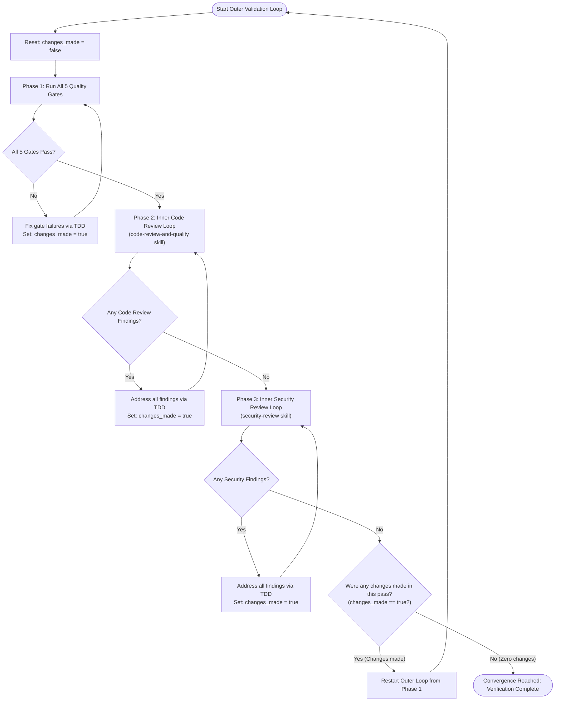

# Verification and Test Suite Validation Rules

These rules govern mandatory verification, test suite execution, code reviews, and quality gates that every agent **MUST** satisfy before considering any task, feature, bug fix, or refactoring complete.

## 1. The Verification & Validation Meta-Loop Architecture

Validation is structured as an **Outer Convergence Loop** enclosing the 5 Quality Gates and **Two Inner Loops** (Code Review and Security Review).

An agent is only permitted to break out of the Outer Loop when an entire pass completes with **zero changes made** across all phases.

### The Convergence Protocol:
1. **Initialize Outer Iteration**: Track whether any files are modified during this outer loop pass (`changes_made = false`).
2. **Phase 1: Quality Gates Execution**: Run the 5 zero-tolerance quality gates. If code or tests must be updated to pass, mark `changes_made = true`.
3. **Phase 2: Inner Code Review Loop**: Invoke the `code-review-and-quality` skill. If findings exist, resolve them completely, mark `changes_made = true`, and re-review until zero findings remain.
4. **Phase 3: Inner Security Review Loop**: Invoke the `security-review` skill. If security findings exist, resolve them completely, mark `changes_made = true`, and re-scan until zero findings remain.
5. **Phase 4: Outer Loop Convergence Decision**:
   - If `changes_made === true`: Code or tests were modified during gate resolution or review fixes. These changes may have introduced regressions, impacted coverage, or spawned mutants. **Restart the Outer Loop from Phase 1**.
   - If `changes_made === false`: All quality gates passed cleanly, code review returned 0 findings on initial scan, and security review returned 0 findings on initial scan without requiring any modifications. **Break out of the loop — verification is complete.**

---

## 2. Phase 1: Zero-Tolerance Quality Gates

Every change to production, test, or configuration code **MUST** pass all five quality gates with 100% compliance:

### Gate 1: Unit & Integration Tests (`npm test`)
- **Requirement**: The Vitest test suite (`vitest run`) must pass completely with **zero test failures**.
- **No Skipped Tests**: Existing tests must never be disabled, skipped (`it.skip`, `test.skip`, `describe.skip`), or commented out to force a green test suite.
- **TDD Compliance**: Every new feature or bug fix must be preceded by a failing test that passes only after production code changes (per `tdd-rules.md`).

### Gate 2: Code Coverage Baseline (`npm run test:coverage`)
- **Requirement**: Code coverage must maintain a strict **100% baseline** across all metrics as configured in `vitest.config.ts`:
  - **100% Statements**
  - **100% Branches**
  - **100% Functions**
  - **100% Lines**
- **No Coverage Drops**: Any new code paths, conditional branches (including error handling, edge cases, and default cases), or helper functions must have full test coverage.

### Gate 3: Mutation Testing & Zero Surviving Mutants (`npm run test:mutation`)
- **Requirement**: Stryker mutation testing (`stryker run`) must achieve a **100.00% Mutation Score** with **zero surviving mutants** (`Survived: 0`).
- **Configuration Enforcement**: Stryker is configured with `thresholds.break: 100`. Any surviving mutant causes the build to fail.
- **Root Cause Resolution**: Surviving mutants indicate missing test assertions or redundant production code. Agents must:
  1. Add precise, behavioral assertions that kill the mutant, OR
  2. Simplify/refactor the production code to eliminate untestable or unreachable redundant branches (applying the Transformation Priority Premise).
  3. Never suppress Stryker mutation checks using mutation comments (e.g. `// Stryker disable`) unless explicitly approved by the user.

### Gate 4: Static Analysis, Linter & Type Integrity (`npm run lint` & `npm run typecheck`)
- **TypeScript Integrity**: `npm run typecheck` (`tsc --noEmit`) must complete with **0 errors**. No `any` escapes or suppressed compiler diagnostics.
- **Extension Linting**: `npm run lint` (`npm run lint:firefox` & `npm run lint:chrome` via `npx web-ext lint`) must pass with **0 errors and 0 warnings**.
- **Code Formatting**: `npm run format:check` must pass cleanly without formatting discrepancies.

### Gate 5: Dual Cross-Browser Production Builds (`npm run build:firefox` & `npm run build:chrome`)
- **Cross-Browser Verification**: Both browser distribution targets must build cleanly with exit code 0:
  - Firefox MV3: `npm run build:firefox` (`dist/`)
  - Chrome MV3: `npm run build:chrome` (`dist-chrome/`)
- **Post-Build Validation**: Post-build transformations (such as `scripts/postbuild-chrome.mjs`) must execute successfully with no missing bundle assets or manifest generation errors.

---

## 3. Phase 2: Inner Code Review Loop (`code-review-and-quality`)

The agent **MUST** execute an iterative review loop adhering to the `code-review-and-quality` skill (`.agents/skills/code-review-and-quality/SKILL.md`):

1. **Review Execution**: Evaluate modified code across all five core dimensions:
   - **Correctness**: Spec conformance, boundary conditions, edge cases, error propagation.
   - **Readability & Simplicity**: Clear naming, clean control flow, no dead code, minimal cognitive complexity.
   - **Architecture**: Proper modular boundaries, clean dependency direction, avoidance of layer leaks.
   - **Security Hygiene**: Safe input sanitization, parameterized queries, output encoding.
   - **Performance**: No unbounded loops, no unnecessary re-renders, clean memory management.
2. **Remediation**:
   - If findings are reported (Critical, Required, or Improvements):
     - Address **every finding** with concrete code improvements.
     - Follow TDD rules if behavioral or logic changes are required.
     - Mark `changes_made = true`.
     - Re-run the code review evaluation against the updated code.
3. **Loop Termination**: Continue looping until the code review returns **zero outstanding findings**.

---

## 4. Phase 3: Inner Security Review Loop (`security-review`)

The agent **MUST** execute an iterative security audit loop adhering to the `security-review` skill (`.agents/skills/security-review/SKILL.md`):

1. **Audit Scope**: Inspect all modified files, touched components, and data paths:
   - **Dependency Audit**: Verify no vulnerable dependencies or risky pinned versions.
   - **Secrets & Sensitive Data**: Scan for exposed API keys, credentials, tokens, or unencrypted storage in IndexedDB/chrome.storage.
   - **Vulnerability Deep Scan**: Audit for DOM XSS, unsafe `innerHTML`, eval equivalents, prototype pollution, and command/parameter injection.
   - **Extension Architecture Security**: Verify Content Security Policy (CSP), WebExtension permissions, postMessage/messaging boundary validation, and external untrusted inputs.
   - **Data Flow Analysis**: Trace all untrusted user inputs (form values, page DOM, web requests) into storage and UI sinks.
2. **Remediation**:
   - If security findings are identified at any severity (CRITICAL, HIGH, MEDIUM, LOW, INFO):
     - Implement rigorous security patches addressing the vulnerability.
     - Add security regression tests per `tdd-rules.md`.
     - Mark `changes_made = true`.
     - Re-run the security review evaluation against the updated codebase.
3. **Loop Termination**: Continue looping until the security review returns **zero outstanding findings**.

---

## 5. Mandatory Verification Sequence Within Iterations

Within each iteration of the outer loop, agents **MUST** execute tasks in the following strict order:

1. **TDD Red-Green Cycle**: Run `npm test` during development to confirm failing and passing states.
2. **Type Checking & Code Formatting**: Run `npm run typecheck` and `npm run format:check` to ensure syntactic and type correctness.
3. **Full Coverage Verification**: Run `npm run test:coverage` to confirm that all 4 coverage dimensions remain at 100%.
4. **Cross-Browser Builds & Linting**: Run `npm run build:firefox`, `npm run build:chrome`, and `npm run lint` to verify production bundle integrity.
5. **Mutation Testing**: Run `npm run test:mutation` (or `npm run test:mutation:smoke` for quick smoke validation) to prove complete mutant slaughter.
6. **Inner Code Review Loop**: Iterate until 0 findings remain.
7. **Inner Security Review Loop**: Iterate until 0 findings remain.
8. **Convergence Check**: Check if any changes were made; if yes, repeat from step 1.

---

## 6. Diagnostic Execution Guidelines

- **Scratch Scripts**: When diagnosing surviving mutants or analyzing review reports, agents **MUST** write analysis scripts to `scratch/<script-name>.js` per `command-execution-rules.md` and execute them as single-line commands.
- **Incremental State**: Stryker uses `"incremental": true`. If cache anomalies or out-of-sync mutants are suspected, clear the specific mutant in `reports/stryker-incremental.json` or clean `.stryker-tmp/` rather than disabling mutation rules.

---

## 7. Final Sign-Off and Reporting

An agent **MUST NOT** conclude a task, report completion, or request review without explicitly confirming that **the outer loop has converged with zero changes on its final pass**, and stating the verified status of all gates:

- **Convergence Status**: Outer loop completed with 0 changes made on the final iteration
- **Unit Tests**: Pass count / 100% green (0 failures)
- **Coverage**: Statements 100%, Branches 100%, Functions 100%, Lines 100%
- **Mutation Score**: 100.00% (0 surviving mutants)
- **Typecheck & Linter**: 0 errors, 0 warnings
- **Cross-Browser Builds**: Firefox (`dist`) & Chrome (`dist-chrome`) successfully built
- **Code Review**: 0 outstanding findings
- **Security Review**: 0 outstanding findings
