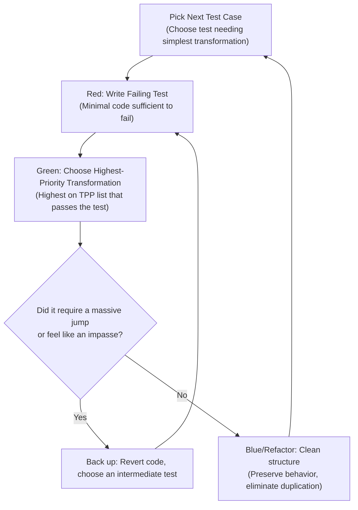

# Transformation Priority Premise (TPP)

## Overview

The **Transformation Priority Premise (TPP)** is a formal refinement to Test-Driven Development (TDD) introduced by Robert C. Martin ("Uncle Bob").

In TDD:
- **Refactorings** change the *structure* of code without changing its *behavior* (done in the **Blue/Refactor** phase).
- **Transformations** change the *behavior* of code (done in the **Green** phase to make a failing test pass).

### The Core Premise

> **"As the tests become more specific, the production code becomes more generic."**

When practicing TDD, developers often face a choice of multiple ways to make a failing test pass. If you pick a transformation that introduces too much complexity or generality too early (e.g., jumping immediately to a loop, recursion, or complex algorithmic data structure), you risk hitting an **impasse** — a state where passing the next simple test requires rewriting the entire method or adding excessive accidental complexity.

TPP defines a prioritized order of transformations: **prefer transformations higher on the list over those lower on the list**. Furthermore, **order your tests so that each test can be satisfied by a high-priority transformation**.

---

## When to Use This Skill

- When practicing TDD and deciding what code to write to make the current failing test pass.
- When selecting the **next test case** to write in a TDD cycle.
- When tempted to write a loop, complex regex, dynamic algorithm, or mutable state early in an implementation.
- When an agent or developer gets "stuck" in TDD and realizes passing a single test requires writing 30+ lines of code (an impasse).
- During code review to identify premature generalization during test-driven feature development.

---

## The Transformation Priority Ladder

Transformations are listed in order of priority (from highest priority / simplest / most specific, to lowest priority / most generic / most complex). Always seek the first transformation on this list that satisfies the failing test.

| Rank | Transformation | Description | Example Before $\to$ After |
|:---:|:---|:---|:---|
| 1 | **({} $\to$ nil)** | No code at all $\to$ code that returns null, void, or empty | `function get() {}` $\to$ `function get() { return null; }` |
| 2 | **(nil $\to$ constant)** | Returning null $\to$ returning a literal constant | `return null;` $\to$ `return 0;` or `return "";` |
| 3 | **(constant $\to$ constant+)** | Simple literal $\to$ more complex literal constant | `return "";` $\to$ `return "hello";` |
| 4 | **(constant $\to$ scalar)** | Literal constant $\to$ variable, argument, or parameter | `return 0;` $\to$ `return n;` |
| 5 | **(statement $\to$ statements)** | Adding another unconditional statement | Single line execution $\to$ sequential multi-statement execution |
| 6 | **(unconditional $\to$ if)** | Splitting execution paths with a conditional branch | `return n;` $\to$ `if (n === 0) return 0; return n;` |
| 7 | **(scalar $\to$ array)** | Scalar value $\to$ array / list / collection | `return item;` $\to$ `return [item];` |
| 8 | **(array $\to$ container)** | Array $\to$ generic hash map, set, or dictionary | `const list = [];` $\to$ `const map = new Map();` |
| 9 | **(statement $\to$ tail-recursion)** | Replacing iteration or repetition with tail recursion | Function call $\to$ tail-recursive self call (in functional languages) |
| 10 | **(if $\to$ while)** | Converting a conditional branch into a loop / iteration | `if (n % 2 === 0)` $\to$ `while (n % 2 === 0)` |
| 11 | **(statement $\to$ non-tail-recursion)** | Adding general recursion that stacks frames | Recursive calls requiring intermediate state accumulation |
| 12 | **(expression $\to$ function)** | Replacing inline logic/expression with function or algorithm | Inline math $\to$ helper algorithm or strategy |
| 13 | **(variable $\to$ mutation)** | Mutating/reassigning a variable state over time | Pure value flow $\to$ `x = x + 1` or stateful accumulator |
| 14 | **(case)** | Adding a branch/case to an existing switch or if-else ladder | Adding `case 'X':` or `else if (...)` |

> [!NOTE]
> **Language Specificity**: In imperative and object-oriented languages (such as JavaScript, TypeScript, Python, Java), iteration `(if -> while)` and assignment `(variable -> mutation)` are often preferred above recursion `(statement -> tail-recursion)` because recursion can overflow call stacks and is less idiomatic than in functional languages (Clojure, Haskell, Elixir).

---

## Practical TDD Workflow with TPP

The strict cycle to follow:



### Step 1: Picking the Next Test Case (The Test Driver)
Alan Ridlehoover emphasized that transformations don't just guide how to write production code — they guide **which test to write next**:
1. Before writing the next test, ask: *"What transformation would be needed to make this test pass?"*
2. If the test would force you to introduce an `(if -> while)` loop or a complex algorithm right away, look for a simpler intermediate test that only requires `(constant -> scalar)` or `(unconditional -> if)`.
3. Order your tests so that each test gently nudges the code up the transformation priority ladder.

### Step 2: The Red Phase
Write the test using the project's TDD rules:
- Write **only** enough of a test to fail or fail to compile.
- Assert the precise expected behavior for that specific input.

### Step 3: The Green Phase (Applying TPP)
1. Start at the top of the TPP ladder (`{} -> nil`, `nil -> constant`, `constant -> scalar`).
2. Ask: *"Can I pass this test using a transformation at rank 1, 2, 3, or 4?"*
3. **Resist premature generalization**:
   - If hardcoding a constant or returning the parameter passes the test, DO IT.
   - Do NOT write a loop for the first test that has multiple iterations if a conditional or repetition handles the current test suite.
   - Do NOT create dynamic object factories or maps until a scalar or simple array is insufficient.

### Step 4: The Refactor Phase
Once all tests pass (Green):
- Refactor to remove duplication and improve naming.
- **Remember**: Refactorings do not change behavior; transformations do. Do not introduce new behavior during the refactor step.

---

## Walkthrough Examples

### Example 1: The Prime Factors Kata (TypeScript)

Watch how TPP drives the implementation without premature loops:

#### Test 1: `factorsOf(1)` is `[]`
- **Transformation**: `({} -> constant)` (Rank 2)
```typescript
export function factorsOf(n: number): number[] {
  return [];
}
```

#### Test 2: `factorsOf(2)` is `[2]`
- **Transformation**: `(unconditional -> if)` (Rank 6) + `(nil/constant -> constant+)` (Rank 3)
```typescript
export function factorsOf(n: number): number[] {
  const factors: number[] = [];
  if (n > 1) {
    factors.push(2);
  }
  return factors;
}
```

#### Test 3: `factorsOf(3)` is `[3]`
- **Transformation**: `(constant -> scalar)` (Rank 4)
- Notice we don't need a loop yet! We just replace constant `2` with argument `n`:
```typescript
export function factorsOf(n: number): number[] {
  const factors: number[] = [];
  if (n > 1) {
    factors.push(n);
  }
  return factors;
}
```

#### Test 4: `factorsOf(4)` is `[2, 2]`
- Now `n === 4` requires factoring `2` twice.
- **Transformation**: `(if -> while)` (Rank 10) + `(variable -> mutation)` (Rank 13)
- We transform `if (n > 1)` into a divisibility check:
```typescript
export function factorsOf(n: number): number[] {
  const factors: number[] = [];
  let divisor = 2;
  while (n > 1) {
    if (n % divisor === 0) {
      factors.push(divisor);
      n /= divisor;
    } else {
      divisor++;
    }
  }
  return factors;
}
```
- Refactoring simplifies this into two tight loops. Notice we were never blocked or forced to guess the algorithm upfront.

---

### Example 2: Domain Logic — Form Input Sanitization

Applying TPP to everyday software engineering tasks:

#### Test 1: Empty input returns empty string
```typescript
expect(sanitizeInput('')).toBe('');
```
- **Transformation**: `({} -> constant)` (Rank 2)
```typescript
export function sanitizeInput(input: string): string {
  return '';
}
```

#### Test 2: Clean input passes through unchanged
```typescript
expect(sanitizeInput('clean')).toBe('clean');
```
- **Transformation**: `(constant -> scalar)` (Rank 4) — *no regex or trims yet!*
```typescript
export function sanitizeInput(input: string): string {
  return input;
}
```

#### Test 3: Leading and trailing whitespace should be trimmed
```typescript
expect(sanitizeInput('  hello  ')).toBe('hello');
```
- **Transformation**: `(expression -> function)` (Rank 12)
```typescript
export function sanitizeInput(input: string): string {
  return input.trim();
}
```

#### Test 4: Strips HTML tags
```typescript
expect(sanitizeInput('<script>alert(1)</script>')).toBe('');
```
- **Transformation**: `(statement -> statements)` (Rank 5) / `(expression -> function)`
```typescript
export function sanitizeInput(input: string): string {
  return input.trim().replace(/<[^>]*>/g, '');
}
```

Notice how tests 1 and 2 established basic contracts using the simplest possible transformations (constant, then scalar) before introducing regex or string operations.

---

## Anti-Patterns and Traps

### 1. Premature Algorithmization
- **Smell**: Writing a complex `for` loop, regular expression, or recursive descent parser to pass test #1 or #2.
- **Correction**: Ask: *"What is the absolute simplest transformation that passes the test?"* If returning a constant passes the test, return the constant. Let subsequent tests force generalization.

### 2. The Speculative Generalization Trap
- **Smell**: Adding parameters, options objects, or extensibility hooks because *"we know we're going to need them later."*
- **Correction**: TPP demands code only becomes generic in response to specific tests. Do not jump down the ladder until a test fails.

### 3. The Impasse (Getting Stuck)
- **Smell**: You write a new test and suddenly find yourself writing 20+ lines of complicated code, or having to rewrite previous methods.
- **Cause**: You jumped too far down the transformation ladder or picked a test that is too big a step.
- **Correction**:
  1. `git stash` or revert the test and implementation.
  2. Identify a smaller intermediate test case that requires a higher-priority transformation.
  3. Re-introduce the problem incrementally.

---

## Quick Reference Checklist

When writing production code in the Green phase of TDD:

- [ ] **Can this be solved with a constant?** (`nil -> constant`)
- [ ] **Can this be solved by using the input argument directly?** (`constant -> scalar`)
- [ ] **Can this be solved with a simple unconditional statement?** (`statement -> statements`)
- [ ] **Can this be solved with a single `if` branch?** (`unconditional -> if`)
- [ ] **Only if a single condition is insufficient**, consider a loop (`if -> while`) or container (`scalar -> array / container`).
- [ ] **Only if iteration/mutation is required**, introduce state reassignment (`variable -> mutation`).
- [ ] **Did the test force this generalization**, or did I anticipate it? (If anticipated, delete it!)
