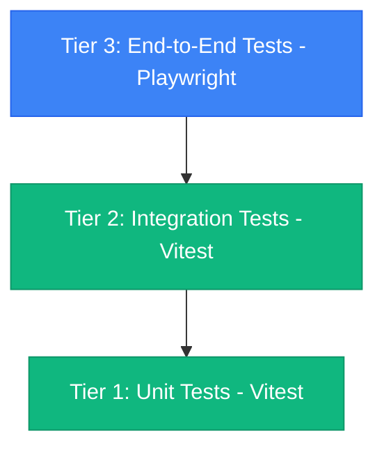

# Lazarus: Form Recovery — Modern WebExtension (Manifest V3) Specification v3.3.0

> **Document Version:** 3.3.0  
> **Status:** Authoritative Architectural Blueprint & Implemented Specification  
> **Target Manifest:** Manifest V3 (Cross-Browser: Firefox Gecko, Chromium, Safari WebKit)  
> **Target Toolchain:** TypeScript 5+, Vite / `@crxjs/vite-plugin`, Dexie.js (IndexedDB), W3C Web Crypto API, Vitest

---

## 1. Executive Summary & Core Principles

Lazarus is a local-first, privacy-preserving browser extension designed to eliminate accidental data loss from form disconnections, accidental tab closures, browser crashes, single-page application (SPA) unmounts, and accidental form resets.

### Core Architectural Guarantees
1. **Local-First, Zero-Cloud:** All form inputs, drafts, and encryption keys are stored exclusively on the user's device. No telemetry, third-party analytics, or external API calls are permitted.
2. **Hexagonal Architecture (Ports & Adapters):** Strict concentric separation between pure core domain logic/use cases (`src/core/`) and outer delivery mechanisms / infrastructure adapters (`src/infrastructure/`, `src/content/`, `src/background/`, `src/views/`). Core domain logic has zero dependencies on `chrome.*` or DOM APIs.
3. **Multi-Version Revision History:** Forms are not treated as single destructive snapshots. The engine preserves chronological revisions (drafts, confirmed submissions, pre-reset states, milestone checkpoints), allowing historical comparison, text diffing, and selective rollback.
4. **Real-Time Reactive Live Sync:** Background event broadcasting immediately updates open extension views (sidepanel, popup) as the user types without requiring manual reloads or polling.
5. **Dynamic Context Menu Version Recovery:** Right-clicking any editable form field dynamically exposes recent form revisions and text snippets for instant in-situ restoration.
6. **Transparent Cryptographic Vault:** Standard mode provides instant zero-configuration local IndexedDB persistence; Master Password mode enforces military-grade AES-GCM-256 encryption via native Web Crypto with an ephemeral in-memory key cache and configurable auto-lock timeout.
7. **Cross-Browser Manifest V3 Architecture:** Native multi-browser distributions targeting Firefox Gecko event pages (`background.scripts`) and Chromium service workers (`background.service_worker`).
8. **Completely Isolated Shadow DOM:** In-situ UI elements (recovery trigger button, dropdown preview menu) are injected into host pages inside a **Closed Shadow Root** (`<lazarus-recovery-host>`), ensuring zero CSS style leaking or DOM event collisions.

---

## 2. Multi-Version Form Revision Engine

### 2.1 The Problem with Single-Snapshot Overwrites
Legacy form recovery tools and naïve MV3 implementations overwrite existing form records on every autosave. This creates critical operational flaws:
- If a user submits a form, re-visits the page, and accidentally types a single character or clears the form, the previous completed submission is permanently erased.
- If a user writes continuously for hours, a simple idle-timeout policy never triggers because each keystroke resets `lastModified`, leaving only a single revision forever.
- Context menus and recovery popups cannot offer rollback points.

### 2.2 Revision Data Model (`IDBForm` & `IDBField`)
To support multiple revisions without unbounded storage growth:
- **`IDBForm` Identity:** Each form revision is assigned a composite primary key:
  $$\text{formId} = \text{domainId} + \text{"\_"} + \text{formInstanceId} + \text{"\_"} + \text{revisionId}$$
  - `domainId`: Normalized hostname (e.g. `github.com`).
  - `formInstanceId`: DOM element identifier (`form.id`, `form.name`, or synthetic container selector).
  - `revisionId`: Unique revision token (`rev_${timestamp}_${rand}`).
  - `revisionNumber`: Incremental integer counter ($1, 2, 3, \dots$) tracking chronological revision sequence for that specific form instance.
  - `isFinalSubmit`: Boolean flag marking confirmed form submissions (`submit` event).
- **`IDBField` Identity:** Each field belongs to its parent form revision:
  $$\text{fieldId} = \text{formId} + \text{"\_"} + \text{fieldName} + \text{"\_"} + \text{fieldType}$$
  - Compound Index on fields: `[domainId+name+type]` enables rapid historical querying of all past values entered into that specific field across all forms and revisions on the domain.

### 2.3 Revision Snapshot Policy & Milestone Checkpoints
To prevent performance degradation and database bloat while still capturing meaningful rollback milestones during long editing sessions:
1. **Continuous Editing Session (Active Draft Update):**
   - Keystrokes within an active 5-minute milestone window update the *current revision in place* via a 500ms debounce.
2. **Milestone Checkpoints ($\Delta t \ge 5\text{ minutes}$):**
   - When active editing on a revision spans $\ge 5$ minutes from its creation timestamp, the engine automatically seals the current draft and branches into an incremented milestone revision ($N+1$). This ensures extended writing sessions generate distinct checkpoints.
3. **Manual Snapshot Force ("Save Snapshot Now"):**
   - Triggered via right-click context menu, shortcut, or UI button. Immediately freezes a new revision checkpoint ($N+1$).
4. **Form Submission Snapshot (`submit` event):**
   - Submitting a form immediately commits a finalized revision with `isFinalSubmit: true`. Subsequent typing automatically branches into a new revision ($N+1$).
5. **Accidental Reset Snapshot (`reset` event):**
   - Clicking a form reset button immediately snapshots the current field values as a pre-reset revision before the browser clears the inputs.
6. **Session Timeout / Page Re-entry ($\Delta t \ge 15\text{ minutes}$):**
   - Re-opening a page or resuming after 15+ minutes of complete inactivity branches into a new chronological revision.

### 2.4 Revision Retention & Pruning Algorithm
- **Cap per Form Instance:** Each form instance retains a maximum of **10 revisions**.
- **Pruning Rule:** When an 11th revision is added, the oldest non-final draft (`isFinalSubmit == false`) is automatically deleted along with its associated fields. Confirmed submissions (`isFinalSubmit == true`) are prioritized and protected from automated pruning.

### 2.5 Multi-Version Retrieval (`getRecoverableText`)
- Queries the compound index `[domainId+name+type]`.
- Decrypts field values in constant-time using AES-GCM.
- Automatically deduplicates identical text entries across revisions, preserving the most recent timestamp for each unique historical value.
- Returns an array of historical snippets ordered by `lastModified DESC`, powering the in-situ dropdown menu and context menus.

### 2.6 Real-Time Event Broadcasting Protocol (`FORM_SAVED`)
- When any form snapshot or submission is committed in the background, the background router broadcasts a high-priority runtime message:
  ```typescript
  {
    type: 'FORM_SAVED',
    payload: {
      domain: string,
      formInstanceId: string,
      revisionNumber: number,
      formId: string
    }
  }
  ```
- **Reactive UI Synchronization:** Open side panels and action popups subscribe to `chrome.runtime.onMessage`. Upon receiving `FORM_SAVED`, they seamlessly refresh the timeline and diff viewer in real-time without interrupting user typing or disturbing scroll position.

---

## 3. Dynamic Context Menu Multi-Version Recovery Protocol

### 3.1 Architecture Overview
Right-clicking an editable field in any web page dynamically presents a hierarchical recovery menu populated with historical revisions for that exact page and field:

```
[Right Click on Form Field]
└── Lazarus Form Recovery
    ├── ⚡ Save Form Snapshot Now
    ├── 🕒 Recover Form Version ▸
    │   ├── Rev 3 (Draft • 1 min ago)
    │   ├── Rev 2 (Submitted • 12 mins ago)
    │   └── Rev 1 (Draft • 25 mins ago)
    ├── 🔤 Recover Field Text ▸
    │   ├── "Detailed order notes..." (1 min ago)
    │   └── "Initial draft notes..." (25 mins ago)
    ├── 📊 Browse Revisions in Sidebar
    └── 🚫 Disable Lazarus on this Site
```

### 3.2 Dynamic Context Menu Lifecycle
1. **Inspection on `contextmenu` / `focus`:**
   - Content script intercepts the `contextmenu` event on trackable elements.
   - Extracts `domain`, `formInstanceId`, `fieldName`, and `fieldType`.
   - Sends `UPDATE_CONTEXT_MENU` to background.
2. **Submenu Synthesis:**
   - Background worker retrieves `getFormRevisions(domain, formInstanceId)` and `getRecoverableText(domain, fieldName, fieldType)`.
   - Rebuilds `lazarus-recover-form-parent` and `lazarus-recover-field-parent` with labeled version items.
3. **Execution & Restoration:**
   - Selecting a form revision item (`lazarus-form-rev-${idx}`) sends `{ action: 'RESTORE_FORM_REVISION', payload: { formId } }` to the active tab.
   - The content script populates all matching fields in the DOM, dispatches synthetic `input` and `change` events (`bubbles: true`, `composed: true`), and flashes a soft emerald visual confirmation.
   - Selecting a text snippet item (`lazarus-field-val-${idx}`) sends `{ action: 'RESTORE_FIELD_TEXT', payload: { value } }` and restores the targeted field.

---

## 4. Cross-Browser Manifest V3 Architecture

### 4.1 Firefox Gecko vs. Chromium MV3 Specifications
Firefox and Chromium diverge in their Manifest V3 background execution and sidebar models:

| Architecture Area | Firefox Gecko Target (`dist/`) | Chromium Target (`dist-chrome/`) |
| :--- | :--- | :--- |
| **Background Execution** | Event Page Scripts: `"background": { "scripts": [...] }` (Mandatory because `background.service_worker` is disabled by default in Firefox) | Service Worker: `"background": { "service_worker": "...", "type": "module" }` |
| **Side View UI** | `"sidebar_action": { "default_panel": "src/sidepanel/sidepanel.html" }` | `"side_panel": { "default_path": "src/sidepanel/sidepanel.html" }` with `"sidePanel"` permission |
| **Extension ID** | Required: `"browser_specific_settings": { "gecko": { "id": "..." } }` | Not required |
| **Host Permissions** | `"<all_urls>"` | `"<all_urls>"` |

### 4.2 Disambiguated Entrypoint Naming Directive
To prevent bundlers (Rollup / `@crxjs/vite-plugin`) from misrouting the content script into the background loader:
- Background Script: `src/background/service-worker.ts`
- Content Script: `src/content/content-script.ts`

---

## 5. Cryptographic Vault Specification

### 5.1 Native Web Crypto API Implementation
- **Key Derivation (PBKDF2):**
  - Algorithm: PBKDF2 with HMAC-SHA-256.
  - Iterations: 100,000 rounds.
  - Salt: Cryptographically secure random 32 bytes (`crypto.getRandomValues(new Uint8Array(32))`), stored in IndexedDB settings (`vault_salt`).
- **Data Encryption (AES-GCM-256):**
  - Symmetric Cipher: AES-GCM with 256-bit derived key.
  - Initialization Vector (IV): Cryptographically random 12 bytes generated per encryption.
  - Serialized Payload: `base64(IV + Ciphertext + AuthTag)`.
- **Zero-Knowledge Sentinel Verification:**
  - The master password is never stored on disk or in browser storage.
  - Upon password configuration, a constant sentinel token (`LAZARUS_VAULT_VERIFIED_v1`) is encrypted and stored in `vault_verification_token`.
  - Decryption validates the password; MAC authentication failure rejects it.
- **In-Memory Key Caching & Auto-Lock:**
  - The derived `CryptoKey` is kept exclusively in service worker memory.
  - Inactivity timer (5m, 15m, 30m, 1h, never) purges the key from memory upon idle timeout.
  - When locked, database queries return placeholder tokens (`[Locked Draft]`).

---

## 6. Multi-Tier Automated Testing Architecture



### 6.1 Tier 1: Unit Tests (`tests/unit/`)
1. `lazarus-db.test.ts`: IndexedDB table schemas, compound indexes, soft-deletion, and query sorting.
2. `web-crypto.test.ts`: WebCrypto PBKDF2 key derivation, AES-GCM encryption/decryption, tampered ciphertext rejection.
3. `vault.test.ts`: Master Password setup, sentinel verification, auto-lock inactivity timers, in-memory key purging, and error conditions.
4. `field-extractor.test.ts`: Luhn credit card detection, CVV scrubbing, standard form controls, multi-selects, non-trackable button exclusion, rich-text editors, and detached input virtual forms.
5. `form-tracker.test.ts`: Debounced input listeners, submit/reset interception, contextmenu trigger, active editing time tracking, idle gap resets, framework synthetic event dispatch, and DOM element restoration.
6. `background.test.ts`: RPC message router dispatch across all 18 runtime message types, domain blocklist filtering, settings management, and export serialization.
7. `alarms.test.ts`: Periodic alarm registration and retention policy execution with error recovery.
8. `context-menus.test.ts`: MV3 context menu registration, dynamic submenu hierarchy, item click handlers, and cross-browser sidebar open fallbacks.
9. `storage-manager.test.ts`: Ephemeral tab autosaves in `chrome.storage.session`, promotion to vault IndexedDB, and tab closure cleanup.
10. `service-worker.test.ts`: Extension lifecycle listeners (`onInstalled`, `onStartup`, `tabs.onRemoved`, `commands.onCommand`, and `onMessage`).
11. `shadow-ui.test.ts`: In-situ Shadow DOM host, trigger button placement with `ResizeObserver`, dropdown menu keyboard navigation and search, and live preview staging/reverting.
12. `rich-text.test.ts`: Universal rich-text adapter factory and DOM implementations for ProseMirror, Quill, TinyMCE, and ContentEditable.
13. `utils.test.ts`: Text formatting, word counts, diff algorithms, DOM element selectors, button viewport clamping, and Luhn credit card validation.
14. `popup.test.ts`: Popup feed rendering, accordion expansion, clipboard copying, domain toggles, global search debouncing, and vault lock/unlock modals.
15. `sidepanel.test.ts`: Control center timeline rendering, date filter chips, keyword filtering, interactive diff viewer, and test playground autosaving.
16. `options.test.ts`: Settings panel navigation, password complexity validation, disabled domain management, storage estimation, JSON data export, and nuclear wipe confirmation.
17. `content-script.test.ts`: In-page bootstrap and tracker initialization.

### 6.2 Tier 2: Integration Tests (`tests/integration/`)
1. `form-recovery-flow.test.ts`:
   - Validates DOM input capture → 500ms debounce timer → background service worker message receipt → Dexie IndexedDB commit → `GET_ALL_HISTORY` and `GET_RECOVERABLE_TEXT` retrieval.
   - Validates **Multi-Version Form Revisions**: tests multiple submissions on the same form, verifying incremental `revisionNumber` generation, `GET_FORM_REVISIONS` chronological ordering, and multiple snippet availability.
   - Validates **Real-Time Live Sync & Broadcast**: tests that background worker emits `FORM_SAVED` on every commit.
   - Validates **Context Menu Form Restoration**: tests `RESTORE_FORM_REVISION` restoring form inputs in the DOM.
2. `vault-flow.test.ts`:
   - Validates the end-to-end cryptographic lifecycle: password creation → raw IndexedDB AES-GCM ciphertext verification → locked vault returning `[Locked Draft]` → password unlock restoring decrypted plaintext.

### 6.3 Tier 3: 100% Code Coverage Mandate & Verification Framework

To guarantee absolute operational reliability in production environments where form data loss would cause catastrophic user frustration, Lazarus mandates a **100% Code Coverage Standard** across the entire codebase.

#### 6.3.1 Coverage Architecture & Toolchain
- **Engine:** `@vitest/coverage-v8` native V8 instrumentation.
- **Environment:** Headless DOM emulation via JSDOM with complete W3C and WebExtension API mocks (`tests/setup.ts`).
- **Execution Script:** `npm run test:coverage` (aliased to `vitest run --coverage`).
- **Granular Verification:** `tests/check-coverage.cjs` provides automated file-by-file line verification.

#### 6.3.2 Module Coverage Matrix
| Module Layer | Covered Files | Target Coverage | Key Validated Branches |
| :--- | :--- | :---: | :--- |
| **Common Utilities** | `text.ts`, `dom.ts`, `pii.ts` | **100%** | Date formatting, word count, LCS diffs, CSS escaping, viewport clamping, Luhn card validation, CVV scrubbing. |
| **Cryptographic Vault** | `web-crypto.ts`, `vault.ts` | **100%** | PBKDF2 (100k iters), AES-GCM-256, auto-lock timer, in-memory key purging, sentinel verification, tampering rejection. |
| **Database & Storage** | `lazarus-db.ts`, `repository.ts`, `storage-manager.ts` | **100%** | Dexie schema, compound indexes, milestone branching, 10-revision pruning, encrypted URL handling, ephemeral session cache. |
| **Content Script Engine** | `form-tracker.ts`, `field-extractor.ts`, `content-script.ts` | **100%** | Input debouncing, submit/reset interception, active editing timers, contextmenu triggers, synthetic DOM events, framework inputs. |
| **Rich Text Adapters** | `prose-mirror.ts`, `quill-adapter.ts`, `tinymce-adapter.ts`, `contenteditable.ts`, `index.ts` | **100%** | DOM detection, HTML value extraction, programmatic value restoration. |
| **In-Situ Shadow DOM UI** | `shadow-host.ts`, `recovery-button.ts`, `recovery-menu.ts`, `live-preview.ts` | **100%** | Closed shadow boundary, `ResizeObserver` positioning, hover live previews, keyboard navigation (Arrow/Enter/Esc), form restoration. |
| **Background Orchestration** | `service-worker.ts`, `alarms.ts`, `context-menus.ts`, `message-router.ts` | **100%** | Lifecycle hooks, 30m cleanup alarms, dynamic hierarchical context menus, broadcast sync, 18 RPC handlers. |
| **Extension Views** | `popup.ts`, `sidepanel.ts`, `options.ts` | **100%** | Feeds, accordions, clipboard copy, diff viewer, test playground, settings sliders, password strength meters, JSON export, nuclear wipe. |

---

## 7. Hexagonal Architecture (Ports & Adapters) Framework

To achieve total runtime resilience, eliminate browser API coupling, and enable 100% pure unit testing, Lazarus adheres to **Hexagonal Architecture (Ports & Adapters)**.

### 7.1 Architectural Layer Topology

```
                  ┌────────────────────────────────────────────────────────┐
                  │                   DELIVERY MECHANISMS                  │
                  │  Webpage DOM • Sidepanel • Popup • Context Menus • RPC │
                  └───────────────────────────┬────────────────────────────┘
                                              │
                                   [Driving Inbound Adapters]
                             ┌────────────────┴────────────────┐
                             │ • DomFormTrackerAdapter         │
                             │ • ExtensionMessageRouterAdapter │
                             │ • ContextMenuClickAdapter       │
                             │ • SidepanelViewAdapter          │
                             │ • PopupViewAdapter              │
                             └────────────────┬────────────────┘
                                              │ (Invokes Driving Ports)
                                              ▼
┌─────────────────────────────────────────────────────────────────────────────────────────────┐
│                                     THE CORE HEXAGON                                        │
│                                                                                             │
│   [Driving Inbound Ports / Use Cases]                                                       │
│   • ISaveFormDraftUseCase          • ISubmitFormUseCase                                     │
│   • IRestoreFormUseCase            • IHistoryQueryUseCase                                   │
│   • IVaultSecurityUseCase          • DomainPolicyUseCase                                    │
│   • RetentionCleanupUseCase                                                                 │
│                                                                                             │
│   [Pure Domain Entities & Value Objects] (Zero dependencies on browser APIs or DOM)         │
│   • FormRevisionPolicy             • PiiSanitizer (Luhn credit card algorithm)             │
│   • TextDiffEngine (LCS diffing)   • EditingSessionTracker                                  │
│                                                                                             │
│   [Driven Outbound Ports] (Contracts for infrastructure)                                    │
│   • IFormRepositoryPort            • IVaultCryptoPort                                       │
│   • IEphemeralStoragePort          • IEventBroadcasterPort                                  │
│   • ISchedulerPort                                                                          │
└─────────────────────────────────────────────┬───────────────────────────────────────────────┘
                                              │ (Implemented by Driven Adapters)
                                   [Driven Outbound Adapters]
                             ┌────────────────┴────────────────┐
                             │ • DexieFormRepositoryAdapter    │
                             │ • WebCryptoVaultAdapter         │
                             │ • ChromeSessionStorageAdapter   │
                             │ • RuntimeBroadcasterAdapter     │
                             │ • ChromeAlarmsAdapter           │
                             └────────────────┬────────────────┘
                                              │
                  ┌───────────────────────────┴────────────────────────────┐
                  │                 INFRASTRUCTURE & PLATFORMS             │
                  │  IndexedDB (Dexie) • W3C WebCrypto • chrome.* Runtime  │
                  └────────────────────────────────────────────────────────┘
```

### 7.2 Directory Layout Standards

```
src/
├── core/
│   ├── domain/               # Pure business models (FormRevisionPolicy, PiiSanitizer, TextDiffEngine)
│   ├── ports/
│   │   ├── inbound/          # Driving use-case interfaces (save, restore, query, vault)
│   │   └── outbound/         # Driven infrastructure interfaces (repository, crypto, cache, broadcaster)
│   ├── use-cases/            # Application services orchestrating domain and ports
│   └── container.ts          # Dependency injection container
├── infrastructure/           # Driven adapters (Dexie, WebCrypto, StorageSession, Alarms, Broadcaster)
├── content/                  # Driving adapter: DOM event tracking & In-Situ Shadow DOM UI
├── background/               # Driving adapter: Message router, alarms, and context menu dispatch
└── views/ (popup, sidepanel) # Driving adapter: Extension UI presentation
```

### 7.3 Core Invariants
1. **Zero Runtime API Bleed:** No file inside `src/core/` may import or reference `chrome.*`, `browser.*`, `window`, or `document`.
2. **Deterministic Domain Rules:** Revision milestone timing ($\Delta t \ge 5\text{ min}$), 10-revision cap calculation, and Luhn credit card detection are strictly encapsulated within pure domain classes.
3. **Mock-Free Testing:** Core domain entities and use cases are verified using pure unit tests with zero browser mock setups and execution times $<15\text{ms}$.

---

## 8. Build Targets & Distribution Guide

### 7.1 Firefox Gecko Package
```bash
npm run build
```
- **Output:** `dist/`
- **Manifest:** `"background": { "scripts": ["assets/service-worker.ts-[hash].js"] }`
- **Installation:**
  1. Open Firefox and navigate to `about:debugging#/runtime/this-firefox`.
  2. Click **"Load Temporary Add-on..."**.
  3. Select `/workspaces/lazarus-form-recovery/dist/manifest.json`.

### 7.2 Chromium / Chrome Package
```bash
npm run build:chrome
```
- **Output:** `dist-chrome/`
- **Manifest:** `"background": { "service_worker": "service-worker-loader.js", "type": "module" }`
- **Installation:**
  1. Open Chrome and navigate to `chrome://extensions/`.
  2. Toggle **Developer mode** on.
  3. Click **"Load unpacked"**.
  4. Select `/workspaces/lazarus-form-recovery/dist-chrome`.
