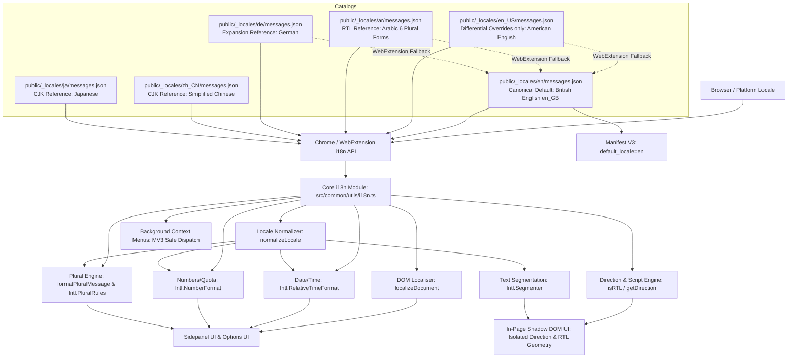

# Localisation (l10n) & Bi-directional (RTL/LTR) Implementation Plan

> **Revision 11** — Updated following Round 11 critique review; all C1–C8 refinements addressed (2026-09-26).
> Incorporates: Universal `normalizeLocale` helper eliminating `RangeError` across all five `Intl` constructors (`getPluralCategory`, `formatRelativeTime`, `formatNumber`, `formatStorageFootprint`, `computeWordCount`), unified 10-language RTL set and differential placeholder inheritance in `withLocale`, resilient regex matcher `/(3|٣) مسودات/` for Arabic count assertions, multi-boundary shadow DOM RTL target detection via `getRootNode().host`, 100% branch/statement coverage fixes for `getUILanguage()` fallback line 54 and `options.ts` `wipe-confirm-label` line 68, defensive `formatNumber` fallback, and full Action Checklist synchronization.
> All new/revised sections are marked **[REVISED - REV 11]**.

## Executive Overview

This plan establishes the architecture, migration roadmap, and verification strategy for adding complete **Localisation (l10n)**, **Bi-directional (LTR & RTL)**, and **East Asian (CJK)** script support to **Lazarus Form Recovery**.

The implementation adheres strictly to:

- **Localisation Rules** ([`localisation-rules.md`](file:///workspaces/lazarus-form-recovery/.agents/rules/localisation-rules.md)) & Skill ([`SKILL.md`](file:///workspaces/lazarus-form-recovery/.agents/skills/localisation-l10n/SKILL.md))
- **Test-Driven Development (TDD)** ([`tdd-rules.md`](file:///workspaces/lazarus-form-recovery/.agents/rules/tdd-rules.md))
- **Command Execution Rules** ([`command-execution-rules.md`](file:///workspaces/lazarus-form-recovery/.agents/rules/command-execution-rules.md))
- **100% Test Coverage Requirement** enforced in [`vitest.config.ts`](file:///workspaces/lazarus-form-recovery/vitest.config.ts) (statements, branches, functions, and lines)
- **WebExtension Manifest V3** standards for cross-browser Firefox Gecko and Chromium engines

---

## 1. Architectural Strategy



### 1.1 Canonical Locale & English Inheritance (`en` = British English)

- **`en` is the canonical British English (`en_GB`) catalog**:
  - `public/_locales/en/messages.json` is the single source of truth for the default catalog.
  - Terminology and spelling follow British English conventions:
    - _Localisation_, _Control Centre_, _serialised_, _initialise_, _colour_, _behaviour_, _customise_.
  - The `public/_locales/en_GB/` directory is **an exact byte-for-byte duplicate** of `en/` (confirmed by `diff`). It will be removed to eliminate catalog drift. **Before deletion, run `diff -q public/_locales/en/messages.json public/_locales/en_GB/messages.json` and assert zero output** (Step 1.3).
- **Regional English Variations (`en_US`)**:
  - Any regional English variant contains **only the differential overrides** where it differs from British English.
  - Leveraging WebExtension native fallback: if the browser locale is `en_US`, Chrome/Firefox look up the key in `_locales/en_US/`, and if absent, automatically fall back to `_locales/en/`.
  - A stub `public/_locales/en_US/messages.json` **must be created** in Phase 5.2 containing genuine differential overrides to validate the fallback inheritance chain:
    ```json
    {
      "optionsTabGeneralSubtitle": {
        "message": "Manage automatic draft saving, retention windows, and core extension behavior.",
        "description": "US English override for behavior"
      },
      "optionsExportSubtitle": {
        "message": "Download complete form history serialized into a JSON backup.",
        "description": "US English override for serialized"
      },
      "optionsWipeConfirmKeyword": {
        "message": "DELETE",
        "description": "US English confirmation keyword"
      }
    }
    ```
- **Manifest V3 Configuration** in [`manifest.config.ts`](file:///workspaces/lazarus-form-recovery/manifest.config.ts):
  ```typescript
  "default_locale": "en"
  ```
  and all visible strings must use `__MSG_*__` placeholders:
  ```typescript
  name: '__MSG_extensionName__',
  description: '__MSG_extensionDescription__',
  action: { default_title: '__MSG_actionTitle__' },
  // Under Firefox branch:
  sidebar_action: { default_title: '__MSG_actionTitle__', ... },
  commands: {
    recover_last_form: {
      description: '__MSG_commandRecoverLastFormDescription__',
      ...
    }
  }
  ```

---

### 1.2 [REVISED - REV 11] East Asian Writing Systems & Segmentation (Simplified Chinese & Japanese)

- **Simplified Chinese (`zh_CN`)** and **Japanese (`ja`)** are supported reference locales.
- **Multilingual Word & Character Counting (`computeWordCount`)**:
  - Ideographic scripts (Hanzi/Kanji) do not employ word spaces. The existing `text.trim().split(/\s+/).length` returns `1` for entire Chinese/Japanese paragraphs.
  - In [`src/common/utils/text.ts`](file:///workspaces/lazarus-form-recovery/src/common/utils/text.ts), update `computeWordCount(text: string, locale?: string)` using `normalizeLocale(locale)` to prevent `RangeError` when passed underscored tags like `'zh_CN'`:
    ```typescript
    import { normalizeLocale } from './i18n';

    export function computeWordCount(text: string, locale?: string): number {
      if (!text) return 0;
      const trimmed = text.trim();
      if (!trimmed) return 0;
      if (typeof Intl !== 'undefined' && (Intl as any).Segmenter) {
        const segmenter = new (Intl as any).Segmenter(normalizeLocale(locale), {
          granularity: 'word',
        });
        let count = 0;
        for (const segment of segmenter.segment(trimmed)) {
          if (segment.isWordLike) count++;
        }
        return count;
      }
      return trimmed.split(/\s+/).length;
    }
    ```
  - **100% Branch Coverage Test**: To satisfy `vitest.config.ts` 100% branch coverage requirements, unit tests in `tests/unit/utils.test.ts` must test both the `Intl.Segmenter` branch AND the fallback branch where `Intl.Segmenter` is temporarily undefined, as well as passing an underscored locale (`'zh_CN'`).
- **CJK Typography & Line-breaking**:
  - Use `overflow-wrap: anywhere;` and `:lang(zh), :lang(ja) { line-height: 1.55; }` in `theme.css`.
  - Font stack in `theme.css` includes regional system fallbacks:
    ```css
    --lz-font-sans:
      'Inter', -apple-system, BlinkMacSystemFont, 'Segoe UI', Roboto, 'PingFang SC',
      'Hiragino Sans', 'Microsoft YaHei', sans-serif;
    ```

---

### 1.3 Localised Confirmation Keywords for Destructive Actions

- **Issue**: Forcing non-European keyboard users (Arabic, Chinese, Japanese) to type ASCII `"DELETE"` creates severe accessibility barriers.
- **Catalog Tokens** (`optionsWipeConfirmKeyword`):
  - `en`: `"DELETE"`
  - `zh_CN`: `"删除"`
  - `ja`: `"削除"`
  - `ar`: `"حذف"`
  - `de`: `"LÖSCHEN"`
- **Shared Validation Helper (`isWipeConfirmationValid`)**:
  - In [`src/options/options.ts`](file:///workspaces/lazarus-form-recovery/src/options/options.ts), there are **two** event listeners checking the keyword:
    1. Line 373: `inputWipeConfirm.addEventListener('input', ...)` (enables/disables the button).
    2. Line 382: `btnConfirmWipe.addEventListener('click', ...)` (executes the wipe).
  - **Falsy & Empty Input Guard**: To prevent accidental deletion if `keyword` is empty or only whitespace, `isWipeConfirmationValid` must explicitly reject empty strings:
    ```typescript
    export function isWipeConfirmationValid(
      input: string,
      keyword: string,
      activeLocale: string
    ): boolean {
      const trimmed = input.trim().normalize('NFKC');
      const normKeyword = (keyword || '').trim().normalize('NFKC');
      if (!trimmed || !normKeyword) return false;

      const matchesLocalised =
        trimmed.toLocaleLowerCase(activeLocale) === normKeyword.toLocaleLowerCase(activeLocale);
      // Safety fallback for catalog load failure; invisible input comparison, not a displayed string
      const matchesEnglish = trimmed.toUpperCase() === 'DELETE';
      return matchesLocalised || matchesEnglish;
    }
    ```
  - **Correct Message Type & Handlers**: Both listeners in `options.ts` must use `isWipeConfirmationValid`, and the click listener must send the correct `{ type: 'CLEAR_ALL_HISTORY' }` message and refresh storage via `calculateStorage()`:
    ```typescript
    inputWipeConfirm.addEventListener('input', () => {
      const keyword = getMessage('optionsWipeConfirmKeyword', undefined, 'DELETE');
      btnConfirmWipe.disabled = !isWipeConfirmationValid(
        inputWipeConfirm.value,
        keyword,
        getUILanguage()
      );
    });

    btnConfirmWipe.addEventListener('click', async () => {
      const keyword = getMessage('optionsWipeConfirmKeyword', undefined, 'DELETE');
      if (isWipeConfirmationValid(inputWipeConfirm.value, keyword, getUILanguage())) {
        await sendOptionsMessage({ type: 'CLEAR_ALL_HISTORY' });
        wipeModal.classList.remove('is-visible');
        await calculateStorage();
        alert(getMessage('optionsAlertWipeSuccess'));
      }
    });
    ```
  - Also ensure line 65 in `init()` uses the explicit fallback:
    ```typescript
    const keyword = getMessage('optionsWipeConfirmKeyword', undefined, 'DELETE');
    ```

---

### 1.4 [REVISED - REV 11] Unified Localisation Engine (`src/common/utils/i18n.ts`)

Zero-dependency module providing:

- **Type-safe lookup**: `getMessage(key: string, substitutions?: string | string[], fallback?: string): string`
  - Passes through to `chrome.i18n.getMessage(key, substitutions)`.
  - Returns `fallback !== undefined ? fallback : key` when empty or unavailable.
  - Relies on native WebExtension fallback chain (`en_US` -> `en`) and test-time catalog integrity tests for `en` completeness.
- **[REVISED - REV 11] Universal Locale Tag Normalization (`normalizeLocale`)**:
  - WebExtension catalog folder names use underscores (`zh_CN`, `en_US`), whereas standard `Intl` constructors (`Intl.PluralRules`, `Intl.RelativeTimeFormat`, `Intl.DateTimeFormat`, `Intl.NumberFormat`, `Intl.Segmenter`) strictly require BCP 47 hyphens (`zh-CN`, `en-US`) and throw `RangeError: Invalid language tag` if underscores are present.
  - Define and export a centralized normalizer used across ALL `Intl` constructors:
    ```typescript
    export function normalizeLocale(locale?: string): string {
      const loc = locale || getUILanguage();
      return loc.replace(/_/g, '-');
    }
    ```
- **[REVISED - REV 11] Robust Plural Category (`getPluralCategory`)**:
  - Uses `normalizeLocale(locale)` and wraps in `try / catch` fallback to guarantee no uncaught `RangeError` exceptions can ever crash the extension:
    ```typescript
    export function getPluralCategory(count: number, locale?: string): Intl.LDMLPluralRule {
      try {
        const loc = normalizeLocale(locale);
        return new Intl.PluralRules(loc).select(count);
      } catch {
        return count === 1 ? 'one' : 'other';
      }
    }
    ```
- **Plural Engine (`formatPluralMessage`)**:
  - **Placeholder Indexing Convention**: `$COUNT$` is always mapped to `$1`. Any additional parameter substitutions passed in `substitutions?: string[]` map sequentially to `$2`, `$3`, etc.
  - **The Fallback Trap**: `getMessage(key)` without a fallback returns `key` (a non-empty truthy string). If `formatPluralMessage` naively checked `getMessage(categoryKey) || getMessage(otherKey)`, it would treat any missing category key as found and output the raw key name (e.g. `baseKey_few`)!
  - **Explicit Fallback Protocol & Deduplicated Candidate Keys**: `formatPluralMessage` must pass an explicit empty string `''` as fallback to `getMessage()`, deduplicate candidates when `category === 'other'`, and use case-insensitive `/gi` replacement:
    ```typescript
    export function formatPluralMessage(
      baseKey: string,
      count: number,
      substitutions?: string[],
      locale?: string
    ): string {
      const loc = locale || getUILanguage();
      const category = getPluralCategory(count, loc);
      const formattedCount = formatNumber(count, undefined, loc);
      const subs = [formattedCount, ...(substitutions || [])];

      const candidateKeys =
        category === 'other'
          ? [`${baseKey}_other`, baseKey]
          : [`${baseKey}_${category}`, `${baseKey}_other`, baseKey];

      for (const key of candidateKeys) {
        // Pass '' as fallback so missing keys return empty string, NOT raw key name!
        const msg = getMessage(key, subs, '');
        if (msg) {
          return msg.replace(/\$COUNT\$/gi, formattedCount);
        }
      }

      return `${formattedCount} ${baseKey}`;
    }
    ```
- **Bi-directional detection**:
  - `getUILanguage()` (defaults to `'en-GB'`). Note: unit tests must test the branch where `chrome.i18n` is missing AND `navigator.language` is empty to achieve 100% line coverage on the `'en-GB'` return statement (line 54).
  - `getDirection()` and `isRTL()`.
- **Standard `Intl` formatters**:
  - **[REVISED - REV 11] `formatRelativeTime(timestamp: number, locale?: string): string`**:
    - **Defensive timestamp guard**: If `!timestamp || isNaN(timestamp)`, immediately return `getMessage('timeUnknown', undefined, 'Unknown time')` to prevent `RangeError: Invalid time value`.
    - Recent timestamps (< 30s): `getMessage('timeJustNow', undefined, 'just now')`.
    - Relative formatting: `Intl.RelativeTimeFormat(normalizeLocale(locale), { numeric: 'auto' })` for minutes (< 1h), hours (< 24h), days (< 7d).
    - Older dates (>= 7d): `Intl.DateTimeFormat(normalizeLocale(locale), { month: 'short', day: 'numeric', year: 'numeric' })`.
  - **[REVISED - REV 11] `formatNumber(value: number, options?: Intl.NumberFormatOptions, locale?: string): string`**:
    - Wrapped in defensive `try / catch` falling back to `'en-GB'` if an invalid tag is passed:
      ```typescript
      export function formatNumber(
        value: number,
        options?: Intl.NumberFormatOptions,
        locale?: string
      ): string {
        try {
          return new Intl.NumberFormat(normalizeLocale(locale), options).format(value);
        } catch {
          return new Intl.NumberFormat('en-GB', options).format(value);
        }
      }
      ```
  - **[REVISED - REV 11] `formatStorageFootprint(usageBytes: number, quotaBytes?: number, locale?: string)`**:
    - Uses `normalizeLocale(locale)` with `Intl.NumberFormat` instead of `toFixed()`.
- **Declarative DOM Localiser**: `localizeDocument(root?: Document | HTMLElement): void`
  - Attributes: `data-i18n`, `data-i18n-placeholder`, `data-i18n-title`, `data-i18n-aria-label`.
  - Sets root `dir` and `lang` on the **host document's `<html>` element** — **not** on shadow DOM containers (see Section 2.3).
- **[REVISED - REV 11] Test Mocking (`tests/setup.ts`) & Shared Test Utility (`tests/unit/test-utils.ts`)**:
  - **In `tests/setup.ts`**:
    - `chrome.i18n.getMessage`: Return `""` on missing keys (matching browser standard).
    - `chrome.i18n.getUILanguage`: Mock returning active locale (defaults to `'en-GB'`).
    - Dedicated `@@bidi_dir` handler: In Chrome, `@@bidi_dir` is a runtime pre-defined message, not an entry in `messages.json`. The mock in `setup.ts` must return `'rtl'` for RTL locales and `'ltr'` otherwise:
      ```typescript
      if (key === '@@bidi_dir') {
        const lang = (chrome.i18n.getUILanguage?.() || 'en').toLowerCase().split(/[-_]/)[0];
        return ['ar', 'he', 'fa', 'ur', 'yi', 'ps', 'sd', 'ug', 'syr', 'ku'].includes(lang)
          ? 'rtl'
          : 'ltr';
      }
      ```
  - **In `tests/unit/test-utils.ts`**:
    - Full 10 RTL language codes matching `setup.ts` and `RTL_LANGUAGES`:
      `['ar', 'he', 'fa', 'ur', 'yi', 'ps', 'sd', 'ug', 'syr', 'ku']`.
    - Placeholder inheritance: `const placeholders = entry.placeholders || enCatalog[key]?.placeholders;` so regional overrides inherit parameter definitions from `en`:
      ```typescript
      import fs from 'node:fs';
      import path from 'node:path';
      import { vi } from 'vitest';

      const catalogs: Record<string, Record<string, any>> = {};

      function getCatalog(locale: string): Record<string, any> {
        const normalized = locale.replace('-', '_');
        if (catalogs[normalized]) return catalogs[normalized];

        let p = path.resolve(__dirname, `../../public/_locales/${normalized}/messages.json`);
        if (!fs.existsSync(p)) {
          const base = normalized.split('_')[0];
          p = path.resolve(__dirname, `../../public/_locales/${base}/messages.json`);
        }

        if (fs.existsSync(p)) {
          catalogs[normalized] = JSON.parse(fs.readFileSync(p, 'utf8'));
        } else {
          catalogs[normalized] = {};
        }
        return catalogs[normalized];
      }

      const RTL_LANGUAGES = new Set(['ar', 'he', 'fa', 'ur', 'yi', 'ps', 'sd', 'ug', 'syr', 'ku']);

      export async function withLocale<T>(locale: string, fn: () => T | Promise<T>): Promise<T> {
        const origGetMessage = chrome.i18n.getMessage;
        const origGetUILang = chrome.i18n.getUILanguage;

        const primary = getCatalog(locale);
        const enCatalog = getCatalog('en');

        (chrome.i18n.getUILanguage as any) = vi.fn(() => locale);
        (chrome.i18n.getMessage as any) = vi.fn(
          (key: string, substitutions?: string | string[]) => {
            if (key === '@@bidi_dir') {
              const lang = locale.toLowerCase().split(/[-_]/)[0];
              return RTL_LANGUAGES.has(lang) ? 'rtl' : 'ltr';
            }

            const entry = primary[key] || enCatalog[key];
            if (!entry) return '';

            let msg = entry.message;
            if (substitutions) {
              const subs = Array.isArray(substitutions) ? substitutions : [substitutions];
              const placeholders = entry.placeholders || enCatalog[key]?.placeholders;
              if (placeholders) {
                for (const p in placeholders) {
                  const content = placeholders[p].content;
                  const indexMatch = content.match(/\$(\d+)/);
                  if (indexMatch) {
                    const idx = parseInt(indexMatch[1], 10) - 1;
                    if (subs[idx] !== undefined) {
                      msg = msg.replace(new RegExp(`\\$${p}\\$`, 'gi'), subs[idx]);
                    }
                  }
                }
              }
              subs.forEach((sub, i) => {
                msg = msg.replace(new RegExp(`\\$${i + 1}`, 'g'), sub);
              });
            }
            return msg;
          }
        );

        try {
          return await fn();
        } finally {
          chrome.i18n.getMessage = origGetMessage;
          chrome.i18n.getUILanguage = origGetUILang;
        }
      }
      ```

---

## 2. Layout, RTL Geometry & Shadow DOM Isolation

### 2.1 CSS Logical Properties Migration

- All physical directional properties (`left`, `right`, `margin-*`, `padding-*`) migrated to logical counterparts (`inset-inline-start`, `inset-inline-end`, `margin-inline-*`, `padding-inline-*`).
- **`shadow-ui.css` updates**:
  - **Do NOT change line 5**: `:host { left: 0 !important; top: 0 !important; }` MUST remain physical to act as an absolute `(0, 0)` page coordinate anchor for both LTR and RTL.
  - Line 73: `.lz-menu-card { right: 0; }` must be **removed entirely** (or set to `right: auto;`) so horizontal positioning is exclusively controlled by JavaScript's calculated `style.left` in both LTR and RTL without conflicting CSS overrides.
  - Lines 269–272: Touch target `top: -6px; left: -6px; right: -6px; bottom: -6px;` on `.lz-trigger-btn::before` replaced with modern logical shorthand `inset: -6px;`.
- **`options.css` updates**:
  - Replace lines 380–382 (`top: 0; left: 0; right: 0; bottom: 0;`) on `.modal-overlay` with modern logical shorthand `inset: 0;`.

### 2.2 In-Page Button & Menu Positioning (`dom.ts` & `recovery-menu.ts`)

- **Shared Sanitization Utilities**:
  - Move `escapeHtml(str: string)` and `escapeAttr(str: string)` from `src/sidepanel/sidepanel.ts` into `src/common/utils/dom.ts`, and re-export them from `sidepanel.ts` for backward compatibility. This allows `recovery-menu.ts` and other UI scripts to safely escape localized text.
- **[REVISED - REV 11] Trigger Button (`computeButtonPosition` in [`src/common/utils/dom.ts`](file:///workspaces/lazarus-form-recovery/src/common/utils/dom.ts))**:
  - Multi-boundary RTL target detection checking computed style, element attribute, ancestor attribute, shadow root host hierarchy, and document root attributes:
    ```typescript
    const win = target.ownerDocument?.defaultView || window;
    const root = typeof target.getRootNode === 'function' ? target.getRootNode() : null;
    const host = root && 'host' in root ? (root as ShadowRoot).host : null;

    const isRtl =
      (win.getComputedStyle ? win.getComputedStyle(target).direction : '') === 'rtl' ||
      target.dir === 'rtl' ||
      (typeof target.closest === 'function' && !!target.closest('[dir="rtl"]')) ||
      (host && typeof host.closest === 'function' && !!host.closest('[dir="rtl"]')) ||
      target.ownerDocument?.documentElement?.getAttribute('dir') === 'rtl' ||
      target.ownerDocument?.body?.getAttribute('dir') === 'rtl';
    ```
  - **LTR Placement**:
    - Internal: `left + rect.width - btnWidth - 6` (top-right corner).
    - External: `left + rect.width + 4` (outside right edge).
  - **RTL Placement**:
    - Internal: `left + 6` (top-left corner).
    - External: `left - btnWidth - 4` (outside left edge).
- **Dropdown Menu Positioning (`RecoveryMenu.show` in [`src/content/shadow-ui/recovery-menu.ts`](file:///workspaces/lazarus-form-recovery/src/content/shadow-ui/recovery-menu.ts))**:
  - Detect RTL context: `const isRtl = isRTL();`
  - In LTR: anchor menu right edge to button (`menuLeft = buttonLeft - menuWidth + 24`).
  - In RTL: anchor menu left edge to button (`menuLeft = buttonLeft`).
  - Clamp within `viewportLeft + 10` and `viewportLeft + viewportWidth - menuWidth - 10`.
- **Counter Badge Initial Render & Dynamic Refresh**:
  - In `RecoveryMenu.render()` line 105, interpolate localized counter using `${escapeHtml(formatPluralMessage('shadowMenuDraftCount', this.filteredItems.length))}` so initial DOM construction never flashes unlocalized English `"X drafts"`.
  - In `RecoveryMenu.renderList()`, whenever the filtered items change (e.g. typing into search), dynamically update the header counter badge:
    ```typescript
    const counter = this.container.querySelector('.lz-item-counter');
    if (counter) {
      counter.textContent = formatPluralMessage('shadowMenuDraftCount', this.filteredItems.length);
    }
    ```

### 2.3 Shadow DOM Direction Isolation & User Content

- **Extension UI Direction Isolation**:
  - `<lazarus-recovery-host>` inherits the host webpage's text direction by default — which is incorrect when a user with an Arabic browser visits an English site.
  - In [`src/content/shadow-ui/shadow-host.ts`](file:///workspaces/lazarus-form-recovery/src/content/shadow-ui/shadow-host.ts), `LazarusRecoveryHost` is a custom element (`class LazarusRecoveryHost extends HTMLElement`).
  - **Attributes via `connectedCallback`**: To comply with Web Component specifications, attributes must not be mutated in the constructor. Add a `connectedCallback()` to set `dir` and `lang`:
    ```typescript
    connectedCallback() {
      this.setAttribute('dir', getDirection());
      this.setAttribute('lang', getUILanguage());
    }
    ```
  - **`all: initial !important` Fix in `shadow-ui.css`**: Because `:host` declares `all: initial !important;`, it resets `direction` to `ltr`. Add explicit `:host` directional rules in `shadow-ui.css`:
    ```css
    :host([dir='rtl']) {
      direction: rtl !important;
    }
    :host([dir='ltr']) {
      direction: ltr !important;
    }
    ```
- **User Content Bi-directional Isolation**:
  - User drafts in Arabic or Hebrew on an English page (or vice versa) must render in their native direction.
  - Apply `dir="auto"` and `unicode-bidi: plaintext;` to `.lz-snippet-preview` and `.field-value`.

---

## 3. Scope of String Extractions & Catalog Keys

### 3.1 Manifest V3 (`manifest.config.ts`)

- `"name"` -> `"__MSG_extensionName__"`
- `"description"` -> `"__MSG_extensionDescription__"`
- `"action.default_title"` -> `"__MSG_actionTitle__"`
- `"sidebar_action.default_title"` -> `"__MSG_actionTitle__"`
- `"commands.recover_last_form.description"` -> `"__MSG_commandRecoverLastFormDescription__"`
- `"default_locale": "en"`
- **Testing Scope**: Unit tests in Phase 1.1 test [`manifest.config.ts`](file:///workspaces/lazarus-form-recovery/manifest.config.ts) directly. Build artifact preservation in `dist/manifest.json` is asserted in the Phase 5.3 Quality Gate.

### 3.2 `confirm()` Audit & Dead Key Cleanup

| File                                     | Line | Environment        | Treatment                                                                                                                                                                             |
| ---------------------------------------- | ---- | ------------------ | ------------------------------------------------------------------------------------------------------------------------------------------------------------------------------------- |
| `src/background/context-menus.ts`        | 280  | MV3 Service Worker | **Remove `confirm()` entirely.** Call `repository.disableDomain(domain, false)` directly. No toast/notification (avoids `"notifications"` permission; action is undoable in Options). |
| `src/content/shadow-ui/recovery-menu.ts` | 170  | Content script     | **`confirm()` is valid.** Replace hardcoded template string with `getMessage('shadowMenuDisableConfirm', [window.location.hostname])`.                                                |
| `src/sidepanel/sidepanel.ts`             | 397  | Extension page     | **Leave `confirm()` intact.** Already uses `getMessage('sidepanelConfirmClearHistory')`.                                                                                              |
| `src/sidepanel/sidepanel.ts`             | 419  | Extension page     | **Leave `confirm()` intact.** Already uses `getMessage('sidepanelConfirmPauseDomain', [currentDomain])`.                                                                              |
| `src/options/options.ts`                 | 174  | Extension page     | **Leave `confirm()` intact.** Already uses `getMessage('optionsConfirmSwitchStandard')`.                                                                                              |

- **Dead Key Cleanup**: Removing `confirm()` from `context-menus.ts` renders `contextMenuDisableConfirm` in [`public/_locales/en/messages.json`](file:///workspaces/lazarus-form-recovery/public/_locales/en/messages.json#L93) orphaned. It should be removed from `en`, `ja`, and `zh_CN` during Phase 1.3 catalog cleanup.

### 3.3 Context Menu String Extractions (`context-menus.ts`)

Replace hardcoded strings with `getMessage()`:

- `contextMenuRoot`, `contextMenuSaveNow`, `contextMenuRecoverForm`
- `contextMenuRecoverField`, `contextMenuOpenSidebar`, `contextMenuOpenOptions`, `contextMenuOptionsFirefox`, `contextMenuDisableDomain`
- `contextMenuRevLabel` (`Rev $REV$ ($TYPE$ • $TIME$)`), `contextMenuSnippetLabel` (`"$SNIPPET$" ($TIME$)`)
- `contextMenuTypeSubmitted`, `contextMenuTypeDraft`
- **Double Call-Site Placeholders**:
  - `contextMenuNoFormVersions` ("No past versions on this page") is created in **two** places: line 85 (`buildBaseContextMenus`) AND line 190 (`rebuildSubmenus`). Both must be updated to `getMessage('contextMenuNoFormVersions')`.
  - `contextMenuNoFieldSnippets` ("No past snippets for this field") is created in **two** places: line 102 (`buildBaseContextMenus`) AND line 219 (`rebuildSubmenus`). Both must be updated to `getMessage('contextMenuNoFieldSnippets')`.

### 3.4 In-Page Shadow DOM UI Keys (`shadow-ui/`)

Add the following entries to `public/_locales/en/messages.json`:

```json
"shadowButtonAriaLabel": {
  "message": "Lazarus Form Recovery",
  "description": "Accessible label for the Lazarus trigger button."
},
"shadowButtonTitle": {
  "message": "Recover form drafts (Lazarus)",
  "description": "Tooltip for the Lazarus trigger button."
},
"shadowMenuTitle": {
  "message": "Lazarus Recovery",
  "description": "Title of the Lazarus recovery dropdown menu."
},
"shadowMenuDraftCount_one": {
  "message": "1 draft",
  "description": "Draft count label when exactly 1 draft exists."
},
"shadowMenuDraftCount_other": {
  "message": "$COUNT$ drafts",
  "description": "Draft count label for 2 or more drafts.",
  "placeholders": {
    "count": { "content": "$1", "example": "5" }
  }
},
"shadowMenuSearchPlaceholder": {
  "message": "Search field history...",
  "description": "Placeholder text for the search input in the recovery menu."
},
"shadowMenuRestoreFormTitle": {
  "message": "Restore entire form",
  "description": "Tooltip for the restore-all button in the recovery menu footer."
},
"shadowMenuRestoreFormLabel": {
  "message": "Form",
  "description": "Visible label for the restore-all button."
},
"shadowMenuSettingsTitle": {
  "message": "Lazarus settings",
  "description": "Tooltip for the settings button in the recovery menu footer."
},
"shadowMenuDisableSiteTitle": {
  "message": "Disable on this site",
  "description": "Tooltip for the disable-site button in the recovery menu footer."
},
"shadowMenuEmptyTitle": {
  "message": "No drafts found",
  "description": "Primary text shown when the recovery menu has no items."
},
"shadowMenuEmptySubtitle": {
  "message": "Try typing to save one",
  "description": "Secondary text shown when the recovery menu has no items."
},
"shadowSnippetWordCount_one": {
  "message": "1 word",
  "description": "Word count badge label for a snippet containing exactly 1 word."
},
"shadowSnippetWordCount_other": {
  "message": "$COUNT$ words",
  "description": "Word count badge label for a snippet with 2 or more words.",
  "placeholders": {
    "count": { "content": "$1", "example": "42" }
  }
},
"shadowSnippetEmpty": {
  "message": "(empty)",
  "description": "Preview label shown when a saved draft has no content."
},
"shadowMenuDisableConfirm": {
  "message": "Disable Lazarus on $DOMAIN$?",
  "description": "Browser confirm() prompt when the user disables Lazarus on the current site.",
  "placeholders": {
    "domain": { "content": "$1", "example": "example.com" }
  }
}
```

### 3.5 Arabic Reference Plural Strings (`public/_locales/ar/messages.json`)

The complete 6 Arabic plural forms for `sidepanelDraftCount`, `shadowMenuDraftCount`, and `shadowSnippetWordCount`:

```json
"sidepanelDraftCount_zero": { "message": "0 مسودة", "description": "Arabic zero plural form" },
"sidepanelDraftCount_one": { "message": "مسودة واحدة", "description": "Arabic singular form" },
"sidepanelDraftCount_two": { "message": "مسودتان", "description": "Arabic dual form" },
"sidepanelDraftCount_few": {
  "message": "$COUNT$ مسودات",
  "description": "Arabic few form (3-10)",
  "placeholders": { "count": { "content": "$1" } }
},
"sidepanelDraftCount_many": {
  "message": "$COUNT$ مسودة",
  "description": "Arabic many form (11-99)",
  "placeholders": { "count": { "content": "$1" } }
},
"sidepanelDraftCount_other": {
  "message": "$COUNT$ مسودة",
  "description": "Arabic other form",
  "placeholders": { "count": { "content": "$1" } }
},
"shadowMenuDraftCount_zero": { "message": "0 مسودة", "description": "Arabic zero plural form" },
"shadowMenuDraftCount_one": { "message": "مسودة واحدة", "description": "Arabic singular form" },
"shadowMenuDraftCount_two": { "message": "مسودتان", "description": "Arabic dual form" },
"shadowMenuDraftCount_few": {
  "message": "$COUNT$ مسودات",
  "description": "Arabic few form (3-10)",
  "placeholders": { "count": { "content": "$1" } }
},
"shadowMenuDraftCount_many": {
  "message": "$COUNT$ مسودة",
  "description": "Arabic many form (11-99)",
  "placeholders": { "count": { "content": "$1" } }
},
"shadowMenuDraftCount_other": {
  "message": "$COUNT$ مسودة",
  "description": "Arabic other form",
  "placeholders": { "count": { "content": "$1" } }
},
"shadowSnippetWordCount_zero": { "message": "0 كلمة", "description": "Arabic zero plural form" },
"shadowSnippetWordCount_one": { "message": "كلمة واحدة", "description": "Arabic singular form" },
"shadowSnippetWordCount_two": { "message": "كلمتان", "description": "Arabic dual form" },
"shadowSnippetWordCount_few": {
  "message": "$COUNT$ كلمات",
  "description": "Arabic few form (3-10)",
  "placeholders": { "count": { "content": "$1" } }
},
"shadowSnippetWordCount_many": {
  "message": "$COUNT$ كلمة",
  "description": "Arabic many form (11-99)",
  "placeholders": { "count": { "content": "$1" } }
},
"shadowSnippetWordCount_other": {
  "message": "$COUNT$ كلمة",
  "description": "Arabic other form",
  "placeholders": { "count": { "content": "$1" } }
}
```

---

## 4. Phased Implementation Roadmap (TDD Driven)

```
Phase 1: Manifest, Default Locale & Test Infrastructure Setup
  ├── 1.1 Tests: Write failing tests in tests/unit/manifest.test.ts for:
  │         - default_locale === "en"
  │         - manifest.name === "__MSG_extensionName__"
  │         - manifest.description === "__MSG_extensionDescription__"
  │         - manifest.action.default_title === "__MSG_actionTitle__"
  │         - Under Firefox branch: manifest.sidebar_action.default_title === "__MSG_actionTitle__"
  │           (use conditional check `if ((manifest as any).sidebar_action)`)
  │         - manifest.commands.recover_last_form.description === "__MSG_commandRecoverLastFormDescription__"
  ├── 1.2 Implementation: Update manifest.config.ts with default_locale: "en" and __MSG__ keys
  ├── 1.3 Catalog cleanup:
  │         - Run: diff -q public/_locales/en/messages.json public/_locales/en_GB/messages.json
  │         - Assert zero diff output (files are identical)
  │         - Delete public/_locales/en_GB/ entirely
  │         - Remove orphaned contextMenuDisableConfirm key from en, ja, zh_CN catalogs
  ├── 1.4 Test Mock & Utility: Update tests/setup.ts and create tests/unit/test-utils.ts:
  │         - In setup.ts: Return "" on missing keys from chrome.i18n.getMessage (matching browser standard)
  │         - In setup.ts: Add pre-defined @@bidi_dir mock returning 'rtl' for 10 RTL languages and 'ltr' otherwise
  │         - In setup.ts: Mock chrome.i18n.getUILanguage() returning active locale (defaults to 'en-GB')
  │         - In test-utils.ts: Implement and export async-safe withLocale(locale, fn) helper with:
  │             * Normalized catalog path lookup (hyphen to underscore with base-language fallback)
  │             * Unified 10-language RTL set matching setup.ts
  │             * Differential placeholder inheritance (entry.placeholders || enCatalog[key]?.placeholders)
  │             * try / finally mock restoration across async operations
  └── 1.5 Verification: npm run test (all manifest & setup tests green)

Phase 2: Plural Engine, Normalization, CJK Segmentation & Storage Formatting (TDD Clean)
  ├── 2.1 [REVISED - REV 11] Tests: Add tests in tests/unit/i18n.test.ts:
  │         - Tests for normalizeLocale: converts underscores to hyphens (e.g. 'zh_CN' -> 'zh-CN', 'en_US' -> 'en-US')
  │         - Tests getUILanguage() fallback (line 54): covers branch when chrome.i18n is missing AND navigator.language is empty, returning 'en-GB'
  │         - Tests for formatPluralMessage and getPluralCategory:
  │             * Selects correct LDML categories (one, few, many, other)
  │             * Normalizes underscores to hyphens without throwing RangeError
  │             * Falls back to (count === 1 ? 'one' : 'other') when an invalid locale is provided
  │             * Falls back to _other if category key missing (asserting empty-string fallback protocol)
  │             * Replaces $COUNT$ via substitution or inline token (case-insensitive /gi)
  │             * Validates 6-form Arabic plural rules (0, 1, 2, 3, 11, 100) using an in-test dictionary mock
  │             * Asserts 100% branch coverage: when substitutions array is provided vs omitted, and when candidate keys are missing
  │         - Tests for formatNumber: normalizes underscores, formats numbers, and falls back gracefully to 'en-GB' if invalid locale passed
  │         - Tests for formatRelativeTime:
  │             * Returns getMessage('timeUnknown', undefined, 'Unknown time') when timestamp is 0, NaN, or null/undefined
  │             * Normalizes underscored locales without throwing RangeError
  ├── 2.2 [REVISED - REV 11] Tests: Add tests in tests/unit/utils.test.ts for computeWordCount:
  │         - Counts CJK Hanzi/Kanji characters via Intl.Segmenter without spaces
  │         - Uses normalizeLocale: passes 'zh_CN' and 'ja_JP' without throwing RangeError
  │         - Asserts fallback to whitespace-split when Intl.Segmenter is absent (for 100% branch coverage)
  ├── 2.3 Tests: Update existing storage assertions in tests/unit/options.test.ts:
  │         - Line 744: from 'Using ~2.00 MB of 100 MB available storage quota.' to 'Using ~2 MB of 100 MB available storage quota.'
  │         - Line 927: from 'Using ~0.00 MB of 100 MB available storage quota' to 'Using ~0 MB of 100 MB available storage quota'
  │         - These tests will fail against existing .toFixed() code (TDD Red)
  ├── 2.4 [REVISED - REV 11] Implementation:
  │         - Export normalizeLocale(locale?: string): string in src/common/utils/i18n.ts
  │         - Update getPluralCategory, formatRelativeTime, formatNumber, and formatStorageFootprint to use normalizeLocale
  │         - Implement formatPluralMessage in src/common/utils/i18n.ts (with deduplicated candidates and '' fallback protocol)
  │         - Add invalid timestamp guard to formatRelativeTime returning getMessage('timeUnknown', undefined, 'Unknown time')
  │         - Add defensive try/catch to formatNumber falling back to 'en-GB'
  ├── 2.5 [REVISED - REV 11] Implementation: computeWordCount in src/common/utils/text.ts:
  │         - Import normalizeLocale from './i18n'
  │         - Construct new (Intl as any).Segmenter(normalizeLocale(locale), { granularity: 'word' })
  ├── 2.6 Implementation: Storage number formatting in src/options/options.ts lines 338–339:
  │         - Replace .toFixed(2) and .toFixed(0) with formatStorageFootprint(estimate.usage || 0, estimate.quota, getUILanguage())
  │         - Pass formatted strings to getMessage('optionsStorageEstimate', [formattedUsage, formattedQuota])
  └── 2.7 Maintenance: Retain formatTimeAgo tests in tests/unit/utils.test.ts:
            - Keep formatTimeAgo unit tests (lines 19–39) fully intact to preserve 100% branch coverage on text.ts
            - Mark formatTimeAgo in text.ts as @deprecated; defer test removal and function deletion to Phase 4.4
            - CRITICAL: Ensure PII tests (Luhn, CVV) in utils.test.ts remain untouched to ensure MUTANT_01 and MUTANT_02 are killed

Phase 3: Sidepanel & Options Pluralisation & Destruction Verification
  ├── 3.1 [REVISED - REV 11] Tests: Verify all 10 count assertions in tests/unit/sidepanel.test.ts and add localized plural tests:
  │         - Verify existing English count assertions across all describe blocks:
  │             * lines 162, 198 ('2 drafts', '1 draft')
  │             * lines 1057, 1080, 1101, 1416, 1424, 1429, 1437 ('0 drafts')
  │             * line 1149 ('3 drafts')
  │         - Add dedicated localized plural test in tests/unit/sidepanel.test.ts using `withLocale('ar', ...)`:
  │             * renderEmpty() outputs '0 مسودة'
  │             * renderHistory([1 item]) outputs 'مسودة واحدة'
  │             * renderHistory([2 items]) outputs 'مسودتان'
  │             * renderHistory([3 items]) outputs Arabic few form matching `/(3|٣) مسودات/` (resilient to Western/Eastern digits)
  │         - Verify tests/unit/options.test.ts lines 1208–1218
  ├── 3.2 Refactor: Replace sidepanel.ts ternary checks with formatPluralMessage:
  │         - Import formatPluralMessage from '../common/utils/i18n' at line 4 of src/sidepanel/sidepanel.ts
  │         - Line 181: historyCount.textContent = formatPluralMessage('sidepanelDraftCount', 0);
  │         - Line 224: historyCount.textContent = formatPluralMessage('sidepanelDraftCount', items.length);
  │         - CRITICAL: Do NOT alter or reformat applyFilter in sidepanel.ts (preserves MUTANT_10 detection)
  ├── 3.3 [REVISED - REV 11] Implementation & Tests (Wipe Confirmation & Branch Coverage):
  │         - In src/options/options.ts:
  │             * Extract and export isWipeConfirmationValid(input, keyword, activeLocale) with empty/falsy guards
  │             * Use in input listener (line 373) AND click listener (line 382)
  │             * Use explicit fallback getMessage('optionsWipeConfirmKeyword', undefined, 'DELETE') in all 3 call sites (lines 65, 374, 383)
  │             * Click listener must send { type: 'CLEAR_ALL_HISTORY' } and call calculateStorage()
  │         - In tests/unit/options.test.ts:
  │             * Add a dedicated test mocking getUILanguage to 'ar', optionsWipeConfirmKeyword to 'حذف'
  │             * Assert typing 'حذف' enables Confirm button, typing 'DELETE' also enables button, typing 'wrong' disables it
  │             * Assert clicking Confirm sends CLEAR_ALL_HISTORY and calculates storage
  │             * Add test for line 68 branch: remove document.getElementById('wipe-confirm-label') and assert init() executes without error
  ├── 3.4 CSS & Bidirectional:
  │         - Ensure .field-value has dir="auto" and unicode-bidi: plaintext
  │         - Update src/common/styles/theme.css with overflow-wrap: anywhere;, CJK line-height, and font stack fallback
  └── 3.5 Verification: Vitest passes across sidepanel.test.ts and options.test.ts

Phase 4: Content Script Shadow UI & Context Menus
  ├── 4.1 [REVISED - REV 11] Tests:
  │         - Create tests/unit/dom.test.ts (new file) for computeButtonPosition and sanitization helpers:
  │             * Test escapeHtml and escapeAttr across special characters (&, <, >, ")
  │             * Internal placement (RTL): left: 200, width: 300, height: 40 -> x: 206, y: 108, placement: 'internal'
  │             * External placement (RTL): left: 200, width: 80, height: 20 -> x: 172, y: 98, placement: 'external'
  │             * Viewport clamping (RTL): left: 10, width: 80, height: 20 -> x: 4 (clamped to viewportLeft + 4)
  │             * Target direction via target.dir="rtl", CSS direction: rtl, ancestor closest('[dir="rtl"]'), and shadow root host traversal
  │             * Note: Existing LTR tests in tests/unit/utils.test.ts (lines 314–472) remain intact
  │         - Add tests in tests/unit/shadow-ui.test.ts for:
  │             * Menu localised string rendering (shadowMenuTitle, shadowMenuEmptyTitle, shadowSnippetEmpty, etc.)
  │             * Word count badge using formatPluralMessage('shadowSnippetWordCount', wordCount)
  │             * Dynamic counter update when search filters items
  │             * RTL menu placement: RecoveryMenu.show aligns menuLeft = buttonLeft
  │             * formatRelativeTime used for timestamps
  │             * confirm() prompt using shadowMenuDisableConfirm with domain placeholder (line 1119)
  │         - Update tests/unit/context-menus.test.ts:
  │             * Add test verifying setupContextMenus registers localized titles when getMessage returns custom strings
  │             * Update line 263 timestamp assertion to match formatRelativeTime: '"Short snippet" (just now)' (lowercase j)
  │             * Update line 268 timestamp assertion to match formatRelativeTime: '"This is a very long snippet ..." (1 hour ago)'
  │             * Refactor it('handles domain disable...') lines 439–454 to assert repository.disableDomain
  │               is called directly without confirm()
  ├── 4.2 [REVISED - REV 11] Implementation (DOM & Shadow Host):
  │         - Move escapeHtml and escapeAttr to src/common/utils/dom.ts (and re-export from sidepanel.ts)
  │         - RTL button positioning in src/common/utils/dom.ts (computeButtonPosition with multi-boundary host traversal)
  │         - RTL menu positioning in src/content/shadow-ui/recovery-menu.ts (RecoveryMenu.show)
  │         - In src/content/shadow-ui/shadow-host.ts (LazarusRecoveryHost):
  │             add connectedCallback() calling this.setAttribute('dir', getDirection()) and this.setAttribute('lang', getUILanguage())
  │         - In src/content/shadow-ui/shadow-ui.css:
  │             * Add :host([dir="rtl"]) { direction: rtl !important; }
  │             * Add :host([dir="ltr"]) { direction: ltr !important; }
  │             * Leave line 5 left: 0 !important; top: 0 !important; unchanged
  │             * Remove line 73 right: 0 entirely
  │             * Replace lines 269–272 touch target directional properties with modern logical shorthand `inset: -6px;`
  ├── 4.3 Implementation (UI Localisation):
  │         - Localise recovery-button.ts (aria-label via shadowButtonAriaLabel, title via shadowButtonTitle)
  │         - Localise recovery-menu.ts:
  │             * Header title, search placeholder, footer buttons, empty states
  │             * Line 105: localize initial render counter via formatPluralMessage('shadowMenuDraftCount', this.filteredItems.length)
  │             * Word count badge using formatPluralMessage('shadowSnippetWordCount', wordCount)
  │             * Empty snippet preview using shadowSnippetEmpty
  │             * Timestamps using formatRelativeTime(item.lastModified)
  │             * Dynamic header counter update in renderList() via formatPluralMessage('shadowMenuDraftCount', count)
  │             * Line 170: confirm(getMessage('shadowMenuDisableConfirm', [window.location.hostname]))
  │         - In src/background/context-menus.ts:
  │             * Replace all hardcoded menu titles with getMessage() (including contextMenuOptionsFirefox)
  │             * Update both call sites for contextMenuNoFormVersions (lines 85 & 190) and contextMenuNoFieldSnippets (lines 102 & 219)
  │             * Replace formatTimeAgo with formatRelativeTime
  │             * Remove confirm() at line 280; call repository.disableDomain(domain, false) directly
  └── 4.4 Cleanup: Delete deprecated formatTimeAgo() and its unit tests:
            - Delete formatTimeAgo() from src/common/utils/text.ts
            - Remove formatTimeAgo unit test block (lines 19–39) from tests/unit/utils.test.ts simultaneously
            - Assert 100% coverage maintained across all metrics

Phase 5: Catalog Completeness, Reference Locales & Quality Gate
  ├── 5.1 [REVISED - REV 12] Catalog Integrity Test: Create tests/unit/l10n-catalog.test.ts:
  │         - Scans strictly src/**/*.{ts,html} and manifest.config.ts (excluding tests/**) using bounded regexes and fs/fast-glob:
  │             * \bgetMessage\(\s*['"]([a-zA-Z0-9_@]+)['"] (Note: must filter out native keys starting with @@)
  │             * \bformatPluralMessage\(\s*['"]([a-zA-Z0-9_]+)['"]
  │             * data-i18n(?:-[a-z-]+)?=["']([a-zA-Z0-9_]+)["']
  │             * __MSG_([a-zA-Z0-9_]+)__
  │         - Asserts all referenced getMessage and data-i18n keys exist in public/_locales/en/messages.json
  │         - Asserts for every formatPluralMessage baseKey, `${baseKey}_other` (and for English, `${baseKey}_one`) exists in en/messages.json
  │         - Asserts all $PLACEHOLDER$ tokens in message strings (EXCEPT $COUNT$) have a matching case-insensitive key in entry.placeholders
  │         - Asserts optionsWipeConfirmKeyword exists and is non-empty across all locales
  ├── 5.2 [REVISED - REV 12] Reference Locales:
  │     ├── en_US: Differential override stub (optionsTabGeneralSubtitle, optionsExportSubtitle, optionsWipeConfirmKeyword)
  │     ├── ar: Arabic RTL reference catalog with 6 plural forms (§3.5), optionsWipeConfirmKeyword: "حذف" (Note: @@bidi_dir is native and must NOT be defined here)
  │     ├── de: German layout expansion reference catalog with optionsWipeConfirmKeyword: "LÖSCHEN"
  │     ├── zh_CN: Completed translations with new shadow UI keys and optionsWipeConfirmKeyword: "删除"
  │     └── ja: Completed translations with new shadow UI keys and optionsWipeConfirmKeyword: "削除"
  └── 5.3 Quality Gate: Execute strictly in order:
        1. npm test
        2. npm run test:coverage
        3. npm run typecheck
        4. npm run build:firefox && npm run build:chrome
        5. npm run lint
        6. npm run test:mutation:smoke
```

---

## 5. Verification & Testing Strategy

1. **Automated Unit Tests**:
   - `manifest.test.ts`: Asserts `default_locale === 'en'`, `__MSG_*__` placeholders for `name`, `description`, `action.default_title`, `sidebar_action.default_title`, and `commands.recover_last_form.description`.
   - `i18n.test.ts`: Asserts plural resolution across categories (`one`, `few`, `many`, `other`), underscore-to-hyphen normalization (`normalizeLocale`), empty-string fallback cascade, `getUILanguage()` line 54 fallback, and Arabic 6-form rules. Asserts 100% branch coverage across parameter substitutions and invalid locale handling.
   - `dom.test.ts`: Asserts sanitization (`escapeHtml`, `escapeAttr`) and button coordinates for RTL targets (internal `left + 6`, external `left - btnWidth - 4`, visual viewport clamping, computed style, shadow root host hierarchy, and ancestor `dir="rtl"`).
   - `shadow-ui.test.ts`: Asserts menu layout, button positioning, RTL menu alignment (`menuLeft = buttonLeft`), dynamic count refresh in header on search filter, `shadowMenuDisableConfirm` placeholder substitution, and localized text rendering.
   - `context-menus.test.ts`: Asserts menu items created with localized titles, updated lowercase timestamp assertions (`just now`, `1 hour ago`), and domain disabling directly invoking `repository.disableDomain()`.
   - `options.test.ts`: Asserts storage formatting via `formatStorageFootprint`, wipe confirmation keyword validation across locales, English fallback resilience, and `wipe-confirm-label` absence branch.
2. **Catalog Integrity Test (`tests/unit/l10n-catalog.test.ts`)**:
   - Static analysis extracting keys from files read via fs/fast-glob:
     - `getMessage('...')` string literals (ignoring native `@@*` keys)
     - `formatPluralMessage('baseKey', ...)` base keys (verifying `${baseKey}_other` in catalog)
     - `data-i18n`, `data-i18n-placeholder`, `data-i18n-title`, `data-i18n-aria-label` from HTML templates
     - `__MSG_*__` from manifest
   - Validates that every `$PLACEHOLDER$` token (except `$COUNT$`) has an entry in `placeholders`.
   - Validates that every locale directory provides `optionsWipeConfirmKeyword`.
3. **Realistic Mocking & Isolation**:
   - `tests/setup.ts`:
     - Returns `""` when a key is absent.
     - Simulates runtime `@@bidi_dir` based on the active locale.
     - Mocks `chrome.i18n.getUILanguage()` returning the active test locale.
   - `tests/unit/test-utils.ts`:
     - `withLocale(locale, fn)` dynamically binds catalogs with fallback to `en`, handles `@@bidi_dir`, inherits differential placeholders from `en`, normalizes hyphenated/underscored path tags, and safely restores mocks via `try ... finally` across async operations.
4. **Quality Gate**:
   - `npm test` and `npm run test:coverage` assert 100% code coverage across all metric thresholds.
   - Built `dist/manifest.json` verified to retain `__MSG__` placeholders and command descriptions.
   - `npm run test:mutation:smoke` verifies all 12 semantic regression mutants are killed.

---

## 6. Action Checklist

| #   | Item                                                                                                                                                                                     | Phase                                       | Priority    | Status  |
| --- | ---------------------------------------------------------------------------------------------------------------------------------------------------------------------------------------- | ------------------------------------------- | ----------- | ------- |
| 1   | Write failing `manifest.test.ts` tests for `default_locale`, `__MSG__` keys, sidebar action, and command description                                                                     | 1.1                                         | 🔴 Critical | ❌ TODO |
| 2   | Update `manifest.config.ts` with `default_locale: "en"` and `__MSG__` placeholders                                                                                                       | 1.2                                         | 🔴 Critical | ❌ TODO |
| 3   | Diff `en/` vs `en_GB/`, assert identical, delete `en_GB/`; remove dead `contextMenuDisableConfirm` key                                                                                   | 1.3                                         | 🔴 Critical | ❌ TODO |
| 4   | Update `tests/setup.ts` mock (return `""` on missing keys, add `@@bidi_dir`); create `tests/unit/test-utils.ts` for `withLocale` with 10 RTL languages and placeholder inheritance       | 1.4                                         | 🔴 Critical | ❌ TODO |
| 5   | Write tests for `normalizeLocale`, `getUILanguage()` line 54 fallback, `formatPluralMessage`, `getPluralCategory`, `formatNumber`, and `formatRelativeTime` in `tests/unit/i18n.test.ts` | 2.1                                         | 🔴 Must     | ❌ TODO |
| 6   | Replace `.modal-overlay` directional properties with `inset: 0` in `options.css`                                                                                                         | 2.1                                         | 🔴 Must     | ❌ TODO |
| 7   | Write tests for `computeWordCount` (CJK Hanzi/Kanji, underscored locale, absent-`Intl.Segmenter` fallback) in `tests/unit/utils.test.ts`                                                 | 2.2                                         | 🔴 Must     | ❌ TODO |
| 8   | Update existing storage assertions in `tests/unit/options.test.ts` (lines 744, 927) to expect localised numbers                                                                          | 2.3                                         | 🔴 Must     | ❌ TODO |
| 9   | Implement `normalizeLocale`, `getPluralCategory`, `formatPluralMessage`, defensive `formatNumber`, and `formatRelativeTime` `timeUnknown` guard in `src/common/utils/i18n.ts`            | 2.4                                         | 🔴 Must     | ❌ TODO |
| 10  | Implement `computeWordCount` with `normalizeLocale` and `Intl.Segmenter` in `src/common/utils/text.ts`                                                                                   | 2.5                                         | 🔴 Must     | ❌ TODO |
| 11  | Implement storage formatting in `src/options/options.ts` lines 338–339 using `formatStorageFootprint`                                                                                    | 2.6                                         | 🔴 Must     | ❌ TODO |
| 12  | Retain `formatTimeAgo` unit tests in `tests/unit/utils.test.ts` throughout Phases 2 & 3 to preserve 100% branch coverage                                                                 | 2.7                                         | 🔴 Must     | ❌ TODO |
| 13  | Verify all 10 count assertions and add localized Arabic plural test with `withLocale('ar', ...)` using `/(3                                                                              | ٣) مسودات/`in`tests/unit/sidepanel.test.ts` | 3.1         | 🔴 Must | ❌ TODO |
| 14  | Replace `sidepanel.ts` ternary plural checks with `formatPluralMessage` (lines 181, 224) and add line 4 import                                                                           | 3.2                                         | 🔴 Must     | ❌ TODO |
| 15  | Implement `isWipeConfirmationValid` in `src/options/options.ts` and add tests in `options.test.ts` (including line 68 `wipe-confirm-label` absence)                                      | 3.3                                         | 🔴 Must     | ❌ TODO |
| 16  | Update `src/common/styles/theme.css` with CJK typography and font fallbacks                                                                                                              | 3.4                                         | 🔴 Must     | ❌ TODO |
| 17  | Create `tests/unit/dom.test.ts` with RTL button position (including shadow host traversal) and sanitization tests; update context menus tests and shadow UI tests                        | 4.1                                         | 🔴 Must     | ❌ TODO |
| 18  | Implement RTL support in `computeButtonPosition` (`dom.ts`) with multi-boundary host traversal, and in `RecoveryMenu.show()`                                                             | 4.2                                         | 🔴 Must     | ❌ TODO |
| 19  | Add `connectedCallback` to `LazarusRecoveryHost`; fix `:host([dir="rtl"])` and `inset: -6px` in `shadow-ui.css`                                                                          | 4.2                                         | 🔴 Must     | ❌ TODO |
| 20  | Localise Shadow DOM UI (`recovery-button.ts`, `recovery-menu.ts` lines 105 & 183 with dynamic counter refresh) + add catalog keys                                                        | 4.3                                         | 🔴 Must     | ❌ TODO |
| 21  | Localise `context-menus.ts`: replace titles (both call sites for placeholders), swap `formatTimeAgo`, remove `confirm()` line 280                                                        | 4.3                                         | 🔴 Must     | ❌ TODO |
| 22  | Delete deprecated `formatTimeAgo` from `src/common/utils/text.ts` and remove its unit test block from `tests/unit/utils.test.ts`                                                         | 4.4                                         | 🟡 Should   | ❌ TODO |
| 23  | Create `tests/unit/l10n-catalog.test.ts` catalog integrity test with case-insensitive placeholder validation                                                                             | 5.1                                         | 🔴 Must     | ❌ TODO |
| 24  | Create `en_US` differential stub; complete `ar` (with 6 plural forms), `de`, `zh_CN`, and `ja` reference catalogs                                                                        | 5.2                                         | 🟡 Should   | ❌ TODO |
| 25  | Run complete Quality Gate (`npm test` -> `coverage` -> `typecheck` -> `build` -> `lint` -> `test:mutation:smoke`)                                                                        | 5.3                                         | 🔴 Must     | ❌ TODO |
